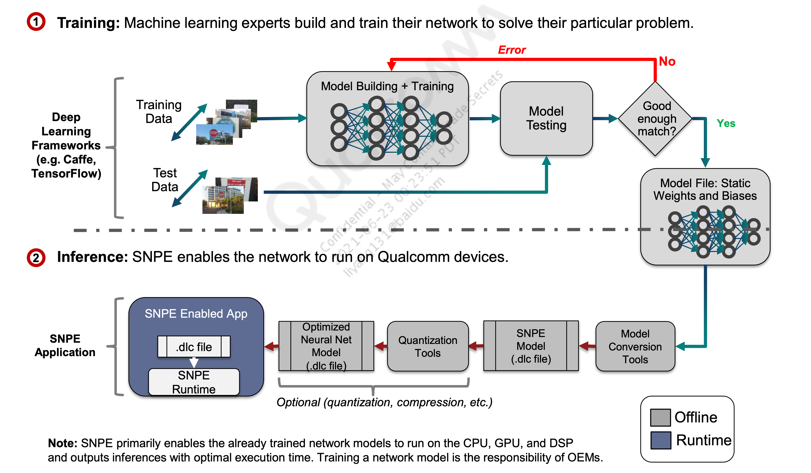

[TOC]

# 概述

| 神经网络层类型                    | 描述                                                         | CPU  | GPU  | DSP/AIP |
| :-------------------------------- | ------------------------------------------------------------ | ---- | ---- | ------- |
| 批量归一化（Batch normalization） | 批量标准化，然后进行缩放操作。批量归一化操作可以单独执行，也可以与缩放结合执行。 | ✔    | ✔    | ✔       |
| 色彩空间转换                      | 将输入图像颜色格式（编码类型）转换为 SNPE 原生颜色空间。颜色空间转换参数作为模型转换器工具的一个选项提供。 | ✔    | ✔    | ✔       |
| Concatenation                     | 该层将多个输入连接成一个输出                                 | ✔    | ✔    | ✔       |
| 回旋                              | 计算过滤器条目和任意位置输入之间的点积                       | ✔    | ✔    | ✔       |
| 裁剪                              | 将一层裁剪为参考层的尺寸                                     | ✔    | ✔    | ✔       |
| 跨图归一化                        | 这是 LRN 层中的一个选项                                      | ✔    | ✔    | ✔       |
| 去卷积                            | Performs deconvolution operation                             | ✔    | ✔    | ✔       |
| 深度卷积                          | 执行 2D 深度卷积                                             | ✔    | ✔    | ✔       |
| Dropout                           | Layer is used for training only. Converters remove this layer from DLC creation. | NA   | NA   | NA      |
| 按元素                            | 支持带系数的 SUM、PROD 和 MAX 模式                           | ✔    | ✔    | ✔       |
| 变平；变单调                      | 将输入展平到图层                                             | ✔    | ✔    | ✔       |
| 全连接                            | 类似于卷积，但连接到完整的输入区域（即过滤器大小正好是输入体积的大小） |      |      |         |

## 深度学习模型到运行时工作流

深度学习框架（caffe、Tensorflow） ==>  训练数据、测试数据 ==> 模型构建和训练 ===> 训练出最优模型 ===> 模型测试   ===> 模型文件：静态权重和偏置  ===> 通过SNPE的模型转换工具   ===> 转换成SNPE模型（deep learning container 深度学习容器） ===> 量化工具   ===> 优化的神经网络模型  ===> SNPE嵌入式的APP  ===> SNPE运行时 ===> SNPE应用

SNPE 主要使已经训练好的网络模型能够在 CPU、GPU 和 DSP 上运行并输出具有最佳执行时间的推理。训练网络模型是 OEM 的责任。

# 基本 SNPE 工作流程

### 神经网络模型转换

将网络模型转换为可由SNPE加载的DLC文件

可选择量化以在Hexagon DSP上运行

### 加载网络模型

实例化SNPE接口并加载DLC文件

选择所需的运行时间（例如 CPU、GPU、DSP、HTA）和其他离线 在线运行时选项

### 准备输入数据

为模型准备输入数据（例如，预处理以匹配模型输入数据层维度，为 DSP 量化输入数据）

### 运行网络模型

使用 SNPE 运行时执行模型，一次输入

## 转换网络模型

1、使用 snpe-深度学习网络框架-to-dlc 将网络模型转换为 DLC

使用 snpe-Caffe-to-dlc 转换基于 Caffe 的模型

使用 snpe-Caffe2-to-dlc 转换基于 Caffe2 的模型

使用 snpe-tensorflow-to-dlc 转换基于 TensorFlow 的模型

2、就像运行 Python 脚本一样简单

脚本的输入是原始训练框架格式的模型

输出是带有转换模型的 DLC 文件，可以直接传入 SNPE

For additional details on conversion tools and syntax, refer to the SDK documentation in <workspace>/snpe-<version>/doc/html/tools.html

## 模型量化

我们使用的snpe-framework-to-dlc进行模型缓缓，默认输出是非量化模型。

所有网络参数都保留在原始模型中的 32 位浮点数

量化是将网络模型转换为最适合在 DSP 上运行的 8 位定点格式的过程

snpe-dlc-quantize 是离线工具，可将非量化 DLC 模型转换为 8 位量化 DLC 模型

量化方法：

权重、偏差和激活的静态量化，支持非对称动态范围和任意步长（类似于 TensorFlow 风格的量化）

仅支持量化定点算法的 SNPE 运行时需要量化模型（例如:DSP  HTA）

## 转换和（可选）量化模型

snpe-<framework>-to-dlc (<framework> = caffe/caffe2/tensorflow/onnx)

就像运行 Python 脚本一样简单

脚本的输入是原始训练框架格式的模型

模型转化的步骤：

脚本的输入是原始训练框架格式的模型

输出是带有转换模型的DLC文件，可以直接传入SNPE

#### snpe-dlc-quantize

将非量化 DLC 模型转换为 8 位量化 DLC 模型

权重、偏差和激活的量化，支持非对称动态范围和任意步长（类似于 TensorFlow 风格的量化）

定点 Snapdragon NPE 运行时（例如 DSP）需要量化模型

也可用于减少磁盘大小（可能会损失一些精度）

## HTA 工具流程概述

## 模型分区

## 根据硬件平台选择量化模型还是非量化模型

### CPU和GPU

GPU 和 CPU 始终使用浮点（非量化）网络参数

如果网络初始化时间是一个问题，建议对 GPU 和 CPU 使用非量化的 DLC 文件（默认）。因为CPU和GPU都是浮点数的运算，所以使用量化后的模型（定点计算）就会有反量化的过程。造成性能损失。

DLC 文件的量化确实会引入噪声，因为量化是有损的

### DSP

DSP 总是使用量化的网络参数

支持在 DSP 上使用非量化 DLC 文件。

网络初始化时间将急剧增加。因为 SNPE 会自动量化网络参数以便在 DSP 上运行。

### HTA

HTA 总是使用量化的网络参数

有关量化的其他详细信息，请参阅 /snpe- 中的 SDK 文档<版本>/doc/html/quantized_models.html

## 量化模型 – 离线 – Tensorflow 或 Caffe 模型

