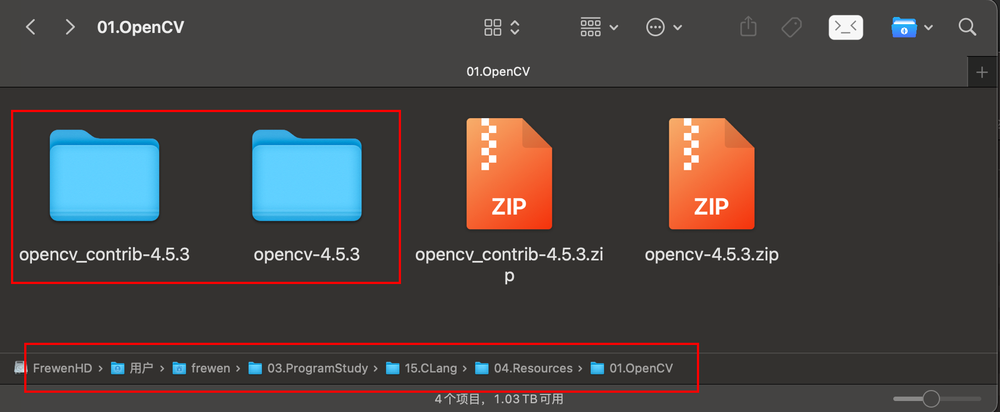

[TOC]

# 概述


文章参考：https://www.361shipin.com/blog/1547810635809554432


# MacOS编译安装OpenCV

## 源码下载

OpenCV 4.6.0源码地址

https://github.com/opencv/opencv/releases/tag/4.6.0

https://github.com/opencv/opencv_contrib/releases/tag/4.6.0

```shell
b1f0002af4792866edbfde6a85346deb78a79c68b019f2d6f13cee7e08cef0aa  opencv-4.6.0-android-sdk.zip
b363dbf9d775afe2e31967d3b2041a0f1efcde6647ce0121422c2dfb64f1ce5b  opencv-4.6.0-docs.zip
e4dc3e29d490c64e39aeaf61661635790232ba646656e6603dfe12786f36ab93  opencv-4.6.0-ios-framework.zip
3fb046e14dc5b50719a86ea0395b5b1e3299e2343111ebd2e31828aa31d6d477  opencv-4.6.0-vc14_vc15.exe
```


## 图形化编译


然后点击Configure，等待之后会列出一些红色项，继续点击Configure直至没有红色项。


现在点击Generate开始生成Binaries。


在终端Terminal中进入build目录，使用命令

```
sudo make
```

运行完毕后再使用命令

```
sudo make install
```

至此就安装完毕了。

提示：`make`时可能需要等待一会儿，喝杯咖啡稍安勿躁。


## 命令行编译

编译配置介绍：

opencv依赖第三方的库，所以当把opencv编译成静态库的时候，注意要把它运行时必要的依赖库也编译进来，opencv源码内有自己的3rdparty，主要有：libjpeg、libpng、libtiff、libzlib、libwebp、libprotobuf、ffmpeg（用到video时编译）、libgtk（用于显示界面显示，服务器部署不会用到），可以通过cmake -LA来查看配置的编译信息，再根据信息考虑把opencv的哪些module编译进来。

| 依赖库名称       | 依赖库说明                                                   | 备注 |
| ---------------- | ------------------------------------------------------------ | ---- |
| IlmImf           | Ilm是Industrial light & magic公司的缩写。Imf是image format的缩写吗？ |      |
| libjasper        | Jasper是JPEG2000的一个非官方实现，由一个国外的一个大学教师实现，还算是个好用的LIB，你可以从http://www.ece.uvic.ca/~mdadams/jasper/地址下在，里面有VC的工程文件。Jpeg60是JPEG的官方实现；其编译只提供makefile来编译。<br/>在图形压缩算法上这里不讨论，这里主要讨论其性能方面的问题：<br/>1>JPEG2000拥有较高质量的图形，即使在100倍的压缩比例下，而JPEG是不行的，压缩比高一定程度就会出现马赛克。<br/>2>高质量的图形是以大量的运算为代价的，所以JPEG2000的时间是很长的，一般对1024*768*24的BMP图进行ENCODE或DECODE需要花费2秒种（P4-3。0）左右的时间，这个时间对于实时应用是很可怕的。Jasper在对JPEG的实现过程中为了保证对多种图形的处理，其算法写的不够精简，先要将待ENCODE的图形转换为其内部的格式，然后再使用JP2000的算法来ENCODE。而JPEG在时间方面有较好的表现，压缩上面的图形在100ms以内，对于大部分实时应用来说还是很好的。<br/>虽然Jasper实现的不够好，我想他的质量还是能够吸引很多人，对于时间要求不长的应用，2秒不算是长时间，我想不久的将来会有更好的JPEG2000实现，哪个时候就可以使用了。 |      |
| libjpeg          | 这是jpeg官方提供的一个jpeg图片压缩和解压缩的库。             |      |
| libpng           | 就是png图片的处理库，可以干关于png图片的各种事情。           |      |
| libtiff          | tiff是tagged image file format的缩写，libtiff是读写tif文件的库。 |      |
| opencv_calib3d   | 用于做camera校准和3维重建的库。                              |      |
| opencv_contrib   | 包含了一些还不是很稳定的功能。                               |      |
| opencv_core      | 提供了一些最基本的图像处理结构体。                           |      |
| opencv_feature   | 特征检测和描述。                                             |      |
| opencv_gpu       | 使用gpu的运算能力的库。                                      |      |
| opencv_highgui   | 用户界面库。                                                 |      |
| opencv_imgproc   | 图像处理库，比如计算直方图，图像变换等。。                   |      |
| opencv_ml        | 机器学习库。                                                 |      |
| opencv_nonfree   | 已经被申请了专利的库，比如sift和surf。                       |      |
| opencv_objdetect | opencv目标检测                                               |      |
| opencv_ocl       | open computing language，通用计算语言，就是说，写一次代码就可以在多核处理器、GPU和DSP上运行。 |      |
| opencv_photo     | 摄影相关的库，比如去除图像上的瑕疵、以及图像去燥。           |      |
| opencv_stitch    | 图像拼接库                                                   |      |
| opencv_superres  | image super resolution，用于增加图片的分辨率，使得模糊的图片更加清晰。 |      |
| opencv_ts        | opencv的测试系统。                                           |      |
| opencv_video     | 视频分析库                                                   |      |
| opencv_videostab | 视频图像去抖动库                                             |      |
| opencv_viz       | 三维虚拟空间库                                               |      |
| zlib             | 基于deflate算法的数据压缩和解压缩算法库                      |      |
|                  |                                                              |      |


```shell
cmake -DEXECUTABLE_OUTPUT_PATH:PATH=$(pwd) \
    -DCMAKE_BUILD_TYPE=RELEASE \
    -DCMAKE_INSTALL_PREFIX=/usr/local \
    -DBUILD_JASPER=ON \
    -DBUILD_JAVA=OFF \
    -DBUILD_JPEG=ON \           #编译opencv 3rdparty自带的libjpeg
    -DBUILD_PERF_TESTS=OFF \
    -DBUILD_PNG=ON \            #编译opencv 3rdparty自带的libpng
    -DBUILD_PROTOBUF=ON \       #编译opencv 3rdparty自带的libprotobuf
    -DBUILD_SHARED_LIBS=NO \    #编译成静态库
    -DBUILD_TESTS=OFF \
    -DBUILD_TIFF=ON \           #编译opencv 3rdparty自带的libtiff
    -DBUILD_ZLIB=ON \           #编译opencv 3rdparty自带的libzlib
    -DBUILD_WEBP=ON \           #编译opencv 3rdparty自带的libwebp
    -DBUILD_opencv_apps=OFF \
    -DBUILD_opencv_core=ON \
    -DBUILD_opencv_calib3d=ON \
    -DBUILD_opencv_dnn=ON \
    -DBUILD_opencv_features2d=ON \
    -DBUILD_opencv_flann=ON \    # 编译opencv  近似最近邻库，NN就是nearest neighbor的缩写。
    -DBUILD_opencv_gapi=OFF \
    -DBUILD_opencv_highgui=ON \
    -DBUILD_opencv_imgcodecs=ON \
    -DBUILD_opencv_imgproc=ON \
    -DBUILD_opencv_java_bindings_generator=OFF \
    -DBUILD_opencv_js=OFF \
    -DBUILD_opencv_ml=ON \
    -DBUILD_opencv_objdetect=OFF \
    -DBUILD_opencv_photo=OFF \
    -DBUILD_opencv_python2=OFF \
    -DBUILD_opencv_python3=OFF \
    -DBUILD_opencv_python_bindings_generator=OFF \
    -DBUILD_opencv_stitching=OFF \
    -DBUILD_opencv_ts=OFF \
    -DBUILD_opencv_video=OFF \
    -DBUILD_opencv_videoio=OFF \
    -DWITH_GTK=OFF \
    -DWITH_GTK_2_X=OFF \
    -DWITH_LAPACK=OFF \
```

- BUILD_IPP_IW 编译Intel IPP集成包装，Intel(R) Integrated Performance Primitives Integration Wrappers
- BUILD_ITT / WITH_ITT 编译/添加Intel? Instrumentation and Tracing Technology (Intel? ITT)支持，代码性能检测用，比如游戏开发中关键性能数据收集，因为ITT API 有开销，不需要的可以关闭
- BUILD_JASPER 编译3rdparty/libjasper项目用于 JPEG-2000 图像编解码支持，http://www.ece.uvic.ca/~frodo/jasper/
- BUILD_OPENEXR 编译3rdparty/openexr项目用于 HDR 图像编解码支持，http://www.openexr.com/
- BUILD_PACKAGE -> Prior to version 2.3 with this you could build a project that will build an [OpenCV](https://so.csdn.net/so/search?q=OpenCV&spm=1001.2101.3001.7020) installer. With this you can easily install your OpenCV flavor on other systems. For the latest source files of OpenCV it generates a new project that simply creates zip archive with OpenCV sources.
- BUILD_PERF_TESTS -> There are also performance tests for many OpenCV functions. If you’re concerned about performance, build them and run.
- BUILD_PROTOBUF http://blog.csdn.net/caisini_vc/article/details/5599468


### MacOS系统上源码编译



当然我们也可以下载OpenCV的3.X的版本

比如：我们下载3.4.6版本：

https://opencv.org/releases/

https://github.com/opencv/opencv/tree/3.4.16

#### 下载contrib的源码

然后我们同样下载contribe的

https://github.com/opencv/opencv_contrib

OpenCV下载地址：https://opencv.org/releases/

下载是对应源码下载地址：

```shell
https://github.com/opencv/opencv/releases/tag/4.6.0

https://github.com/opencv/opencv_contrib/releases/tag/4.6.0
```

下载完成进行解压完成之后：

进入OpenCV的根目录里面，创建一个build目录

进入下面/Users/frewen/03.ProgramStudy/15.CLang/04.Resources/01.OpenCV/opencv-4.5.3/build目录中。执行下面的脚本：

```shell
frewen@FreweniMacbook:~/03.ProgramSpace/20.AI/04.Resource/opencv-3.4.16$ pwd
/user/frewen/03.ProgramSpace/20.AI/04.Resource/opencv-3.4.16
frewen@FreweniMacbook:~/03.ProgramSpace/20.AI/04.Resource/opencv-3.4.16$ mkdir build 
frewen@FreweniMacbook:~/03.ProgramSpace/20.AI/04.Resource/opencv-3.4.16$ cd build 
```

下载完成进行解压完成之后：

进入下面/Users/frewen/03.ProgramStudy/20.AI/04.Resource/OpenCV/opencv-4.5.3/build目录中。执行下面的脚本：

```shell
cmake     \
	-D CMAKE_BUILD_TYPE=RELEASE    \
	-D CMAKE_INSTALL_PREFIX=/Users/wangzhijiang/03.ProgramSpace/20.AILearning/03.Source/opencv-library/opencv4.6.0/opencv-4.6.0/install   \
	-D OPENCV_GENERATE_PKGCONFIG=ON    \
	-D INSTALL_C_EXAMPLES=ON    \
	-D BUILD_EXAMPLES=ON    \
	-D OPENCV_EXTRA_MODULES_PATH=/Users/wangzhijiang/03.ProgramSpace/20.AILearning/03.Source/opencv-library/opencv4.6.0/opencv_contrib-4.6.0/modules   \
	.. 
# 使用4个线程安装

make -j4

# 使用8个线程安装

# make -j8

make install
```

我们需要将opencv.pc中的pkgconfig文件复制到/usr/local/lib/pkgconfig，并将其命名为opencv4.pc。这样，如果你已经安装了OpenCV 3.x.x，则不会发生冲突。让我们继续：
```
export DYLB_LIBRARY_OPENCV_PATH=/Users/frewen/Library/AFrewenLib/opencv4.5.3/lib:$DYLB_LIBRARY_OPENCV_PATH
```

我们需要将opencv.pc中的pkgconfig文件复制到/usr/local/lib/pkgconfig，并将其命名为opencv4.pc。这样，如果你已经安装了OpenCV 3.x.x，则不会发生冲突。让我们继续：

```shell
cp /Users/frewen/Library/AFrewenLib/opencv4.5.3/lib/pkgconfig/opencv4.pc  /usr/local/lib/pkgconfig/opencv4.pc  
```

我们还需要更新PKG_CONFIG_PATH变量。请打开~/.profile文件并添加以下命令行：

```shell
export PKG_CONFIG_PATH=/usr/local/lib/pkgconfig/:$PKG_CONFIG_PATH
```

使用以下命令重新加载~/.profile文件：

综上环境变量设置：

```shell
export DYLB_LIBRARY_OPENCV_PATH=/Users/frewen/Library/AFrewenLib/opencv4.5.3/lib:$DYLB_LIBRARY_OPENCV_PATH
export PKG_CONFIG_PATH=/usr/local/lib/pkgconfig/:$PKG_CONFIG_PATH
```

## 问题解决


# Ubuntu上搭建OpenCV环境（Ubuntu20.04）

OpenCV下载地址：https://opencv.org/releases/

下载是对应源码下载地址：

```shell
# OpenCV4.6.0版本

https://codeload.github.com/opencv/opencv/zip/refs/tags/4.6.0

https://github.com/opencv/opencv_contrib/releases/tag/4.6.0


#OpenCV 3.4.16版本
https://github.com/opencv/opencv/archive/3.4.16.zip

```

我们安装的环境是基于Ubuntu20.04的OpenCV3.4.6版本

安装OpenCV所需要的依赖库

```
sudo apt-get install cmake  libgtk2.0-dev libavcodec-dev libavformat-dev libjpeg.dev libpng-dev libtiff-dev libtiff4.dev libswscale-dev libjasper-dev libcurl4-openssl-dev libtbb2 libdc1394-22-dev libhdf5-serial-dev libcanberra-gtk-module libgtk2.0-dev pkg-config
```

下载完进行解压

```
unzip 3.4.16.zip
```

进入OpenCV的根目录里面，创建一个build目录

进入下面/home/frewen/03.ProgramSpace/20.AILearning/04.Resource/opencv-3.4.16/build目录中。执行下面的脚本：

```shell
frewen@FreweniUbuntu:/home/frewen/03.ProgramSpace/20.AILearning/04.Resource/opencv-3.4.16$ pwd
/home/frewen/03.ProgramSpace/20.AILearning/04.Resource/opencv-3.4.16
frewen@FreweniUbuntu:/home/frewen/03.ProgramSpace/20.AILearning/04.Resource/opencv-3.4.16$ mkdir build  & cd build
frewen@FreweniUbuntu:/home/frewen/03.ProgramSpace/20.AILearning/04.Resource/opencv-3.4.16$ cd build 

cmake .. -D CMAKE_BUILD_TYPE=RELEASE -D CMAKE_INSTALL_PREFIX=/home/frewen/03.ProgramSpace/20.AILearning/04.Resource/opencv-3.4.16/opencv-3.4.16/build -D OPENCV_GENERATE_PKGCONFIG=ON -D INSTALL_C_EXAMPLES=ON -D BUILD_EXAMPLES=ON -D OPENCV_EXTRA_MODULES_PATH=/home/frewen/03.ProgramSpace/20.AILearning/04.Resource/opencv_contrib-3.4.16/modules
..

# 去除编译Example
cmake     \
	-D CMAKE_BUILD_TYPE=RELEASE    \
	-D CMAKE_INSTALL_PREFIX=/home/frewen/03.ProgramSpace/20.AIStudy/03.Source/opencv-library/opencv4.6.0/opencv-4.6.0/install   \
	-D OPENCV_GENERATE_PKGCONFIG=ON    \
	-D INSTALL_C_EXAMPLES=ON    \
	-D BUILD_TIFF=ON  \
	-D BUILD_EXAMPLES=ON    \
	.. 

# 

# 使用4个内核安装
make -j4
make -j8

make install
```

# Anaconda安装OpenCV


```
conda install -c menpo opencv3=3.2.0
```

```
Fetching package metadata ...............
PackageNotFoundError: Package missing in current win-64 channels:
  - opencv3 3.2.0*
```

查了一下原來是 menpo 這個channel 的opencv3。

### 解決方法:

用 `conda-forge` 這個channel 就可以了:

```
conda install -c conda-forge opencv=3.2.0
Fetching package metadata ...............
Solving package specifications: .

```


# MacOS安装OpenCV


## Homebrew安装

首先，使用 homebrew 安装 OpenCV (目前最新的版本是 4.4)。

```
brew install opencv
```

TODO 本人安装报错！！


# 归纳总结

在 Clion 中配置 OpenCV 的开发环境并不繁琐，只需要了解 CMake 即可。配置完之后，就可以开心的使用 OpenCV 处理图像了。


# OpenCV源码编译

## Linux版本编译

源码下载地址：https://codeload.github.com/opencv/opencv/zip/refs/tags/4.7.0

源码下载地址：https://github.com/opencv/opencv_contrib/releases/tag/4.7.0

解压文件

进入下面/home/frewen/03.ProgramSpace/20.AIStudy/03.Source/opencv-library/opencv4.6.0/opencv-4.6.0目录中。

创建build目录，进入目录build目录

执行下面的脚本：

```shell
cmake     \
	-D CMAKE_BUILD_TYPE=RELEASE    \
	-D CMAKE_INSTALL_PREFIX=/home/frewen/03.ProgramSpace/20.AIStudy/03.Source/opencv-library/opencv-2.4.13.4/install   \
	-D OPENCV_GENERATE_PKGCONFIG=ON    \
	-D INSTALL_C_EXAMPLES=ON    \
	-D BUILD_EXAMPLES=OFF    \
	.. 

#  编译OpenCV4.6.0
#  打开BUILD_TIFF编译开关
cmake     \
	-D CMAKE_BUILD_TYPE=RELEASE    \
	-D CMAKE_INSTALL_PREFIX=/home/frewen/03.ProgramSpace/20.AIStudy/03.Source/opencv-library/opencv4.6.0/opencv-4.6.0/install   \
	-D OPENCV_GENERATE_PKGCONFIG=ON    \
	-D INSTALL_C_EXAMPLES=ON    \
	-D BUILD_EXAMPLES=ON    \
	-D BUILD_TIFF=ON  \
	-D OPENCV_EXTRA_MODULES_PATH=/home/frewen/03.ProgramSpace/20.AIStudy/03.Source/opencv-library/opencv4.6.0/opencv_contrib-4.6.0/modules   \
	.. 

#  去掉opencv_contrib的编译选项
cmake     \
	-D CMAKE_BUILD_TYPE=RELEASE    \
	-D CMAKE_INSTALL_PREFIX=/home/frewen/03.ProgramSpace/20.AIStudy/03.Source/opencv-library/opencv4.6.0/opencv-4.6.0/install   \
	-D OPENCV_GENERATE_PKGCONFIG=ON    \
	-D INSTALL_C_EXAMPLES=ON    \
	-D BUILD_EXAMPLES=ON    \
	-D BUILD_TIFF=ON  \
	.. 
	
#  opencv开启编译3rd_party的依赖库
cmake     \
	-D CMAKE_BUILD_TYPE=RELEASE    \
	-D CMAKE_INSTALL_PREFIX=/home/frewen/03.ProgramSpace/20.AIStudy/03.Source/opencv-library/opencv4.6.0/opencv-4.6.0/install   \
	-D OPENCV_GENERATE_PKGCONFIG=ON    \
	-D INSTALL_C_EXAMPLES=ON    \
	-D BUILD_EXAMPLES=ON    \
	-D BUILD_TIFF=ON  \
	-D BUILD_JPEG=ON \
	-D BUILD_PERF_TESTS=OFF \
	-D BUILD_PNG=ON \
	-D WITH_JPEG=ON \
	-D WITH_JASPER=ON \
  -D BUILD_PROTOBUF=OFF \
  -D BUILD_SHARED_LIBS=ON \
  -D BUILD_OPENEXR=ON \
  -D BUILD_JASPER=ON \
  -D BUILD_TESTS=OFF \
  -D BUILD_TIFF=ON \
  -D BUILD_ZLIB=ON \
  -D BUILD_WEBP=ON \
    ..
	
# 编译MacOS版本的opencv的依赖库
#进入opencv4.7.0的源码的build目录
$ pwd
/Users/frewen/03.ProgramStudy/20.AI/04.Resource/opencv-library/opencv4.7.0/opencv-4.7.0/build
# 打开BUILD_TIFF编译开关
# 去掉opencv_contrib的编译选项
# opencv开启编译3rd_party的依赖库
cmake     \
	-D CMAKE_BUILD_TYPE=RELEASE    \
	-D CMAKE_INSTALL_PREFIX=/Users/frewen/03.ProgramStudy/20.AI/04.Resource/opencv-library/opencv4.7.0/opencv-4.7.0/install   \
	-D OPENCV_GENERATE_PKGCONFIG=ON    \
	-D INSTALL_C_EXAMPLES=ON    \
	-D BUILD_EXAMPLES=ON    \
	-D BUILD_TIFF=ON  \
	-D BUILD_JPEG=ON \
	-D BUILD_PERF_TESTS=OFF \
	-D BUILD_PNG=ON \
	-D WITH_JPEG=ON \
	-D WITH_JASPER=ON \
  -D BUILD_PROTOBUF=OFF \
  -D BUILD_SHARED_LIBS=ON \
  -D BUILD_OPENEXR=ON \
  -D BUILD_JASPER=ON \
  -D BUILD_TESTS=OFF \
  -D BUILD_TIFF=ON \
  -D BUILD_ZLIB=ON \
  -D BUILD_WEBP=ON \
    ..
	
# 使用4个线程安装
make -j4
# make -j8  # 使用8个线程安装

make install
```


编译过程出现问题：

```
Scanning dependencies of target opencv_annotation
[ 25%] Building CXX object apps/annotation/CMakeFiles/opencv_annotation.dir/opencv_annotation.cpp.o
[ 25%] Building CXX object modules/bioinspired/CMakeFiles/opencv_bioinspired.dir/src/imagelogpolprojection.cpp.o
[ 25%] Building CXX object modules/calib3d/CMakeFiles/opencv_calib3d.dir/src/levmarq.cpp.o
[ 25%] Building CXX object modules/dnn/CMakeFiles/opencv_dnn.dir/src/layers/softmax_layer.cpp.o
[ 25%] Linking CXX executable ../../bin/opencv_annotation
/usr/bin/ld: ../../lib/libopencv_imgcodecs.so.4.5.0: undefined reference to "TIFFReadRGBAStrip@LIBTIFF_4.0"
/usr/bin/ld: ../../lib/libopencv_imgcodecs.so.4.5.0: undefined reference to "TIFFReadDirectory@LIBTIFF_4.0"
/usr/bin/ld: ../../lib/libopencv_imgcodecs.so.4.5.0: undefined reference to "TIFFWriteEncodedStrip@LIBTIFF_4.0"
/usr/bin/ld: ../../lib/libopencv_imgcodecs.so.4.5.0: undefined reference to "TIFFIsTiled@LIBTIFF_4.0"
/usr/bin/ld: ../../lib/libopencv_imgcodecs.so.4.5.0: undefined reference to "TIFFWriteScanline@LIBTIFF_4.0"
/usr/bin/ld: ../../lib/libopencv_imgcodecs.so.4.5.0: undefined reference to "TIFFGetField@LIBTIFF_4.0"
/usr/bin/ld: ../../lib/libopencv_imgcodecs.so.4.5.0: undefined reference to "TIFFScanlineSize@LIBTIFF_4.0"
/usr/bin/ld: ../../lib/libopencv_imgcodecs.so.4.5.0: undefined reference to "TIFFWriteDirectory@LIBTIFF_4.0"
/usr/bin/ld: ../../lib/libopencv_imgcodecs.so.4.5.0: undefined reference to "TIFFReadEncodedTile@LIBTIFF_4.0"
/usr/bin/ld: ../../lib/libopencv_imgcodecs.so.4.5.0: undefined reference to "TIFFReadRGBATile@LIBTIFF_4.0"
/usr/bin/ld: ../../lib/libopencv_imgcodecs.so.4.5.0: undefined reference to "TIFFClose@LIBTIFF_4.0"
/usr/bin/ld: ../../lib/libopencv_imgcodecs.so.4.5.0: undefined reference to "TIFFClientOpen@LIBTIFF_4.0"
/usr/bin/ld: ../../lib/libopencv_imgcodecs.so.4.5.0: undefined reference to "TIFFRGBAImageOK@LIBTIFF_4.0"
/usr/bin/ld: ../../lib/libopencv_imgcodecs.so.4.5.0: undefined reference to "TIFFOpen@LIBTIFF_4.0"
/usr/bin/ld: ../../lib/libopencv_imgcodecs.so.4.5.0: undefined reference to "TIFFReadEncodedStrip@LIBTIFF_4.0"
/usr/bin/ld: ../../lib/libopencv_imgcodecs.so.4.5.0: undefined reference to "TIFFSetField@LIBTIFF_4.0"
/usr/bin/ld: ../../lib/libopencv_imgcodecs.so.4.5.0: undefined reference to "TIFFSetWarningHandler@LIBTIFF_4.0"
/usr/bin/ld: ../../lib/libopencv_imgcodecs.so.4.5.0: undefined reference to "TIFFSetErrorHandler@LIBTIFF_4.0"
collect2: error: ld returned 1 exit status
make[2]: *** [apps/annotation/CMakeFiles/opencv_annotation.dir/build.make:95: bin/opencv_annotation] Erro 1
make[1]: *** [CMakeFiles/Makefile2:18408: apps/annotation/CMakeFiles/opencv_annotation.dir/all] Erro 2
make[1]: ** Waiting for other processes to finish.
```

解决方法：https://icode.best/i/39706749867569

加上如下编译配置：

```
-D BUILD_EXAMPLES=OFF   
```


### Ubuntu安装opencv_python

```
pip install opencv_python  -i https://pypi.tuna.tsinghua.edu.cn/simple
pip install opencv_python==3.4.10.37  -i https://pypi.tuna.tsinghua.edu.cn/simple
```

## MacOS版本编译

## Linux版本编译

源码下载地址：https://codeload.github.com/opencv/opencv/zip/refs/tags/4.7.0

源码下载地址：https://github.com/opencv/opencv_contrib/releases/tag/4.7.0

解压文件

进入下面/home/frewen/03.ProgramSpace/20.AIStudy/03.Source/opencv-library/opencv4.6.0/opencv-4.6.0目录中。

创建build目录，进入目录build目录

执行下面的脚本：

```shell
cmake     \
	-D CMAKE_BUILD_TYPE=RELEASE    \
	-D CMAKE_INSTALL_PREFIX=/home/frewen/03.ProgramSpace/20.AIStudy/03.Source/opencv-library/opencv-2.4.13.4/install   \
	-D OPENCV_GENERATE_PKGCONFIG=ON    \
	-D INSTALL_C_EXAMPLES=ON    \
	-D BUILD_EXAMPLES=OFF    \
	.. 

#  编译OpenCV4.6.0
#  打开BUILD_TIFF编译开关
cmake     \
	-D CMAKE_BUILD_TYPE=RELEASE    \
	-D CMAKE_INSTALL_PREFIX=/home/frewen/03.ProgramSpace/20.AIStudy/03.Source/opencv-library/opencv4.6.0/opencv-4.6.0/install   \
	-D OPENCV_GENERATE_PKGCONFIG=ON    \
	-D INSTALL_C_EXAMPLES=ON    \
	-D BUILD_EXAMPLES=ON    \
	-D BUILD_TIFF=ON  \
	-D OPENCV_EXTRA_MODULES_PATH=/home/frewen/03.ProgramSpace/20.AIStudy/03.Source/opencv-library/opencv4.6.0/opencv_contrib-4.6.0/modules   \
	.. 

#  去掉opencv_contrib的编译选项
cmake     \
	-D CMAKE_BUILD_TYPE=RELEASE    \
	-D CMAKE_INSTALL_PREFIX=/home/frewen/03.ProgramSpace/20.AIStudy/03.Source/opencv-library/opencv4.6.0/opencv-4.6.0/install   \
	-D OPENCV_GENERATE_PKGCONFIG=ON    \
	-D INSTALL_C_EXAMPLES=ON    \
	-D BUILD_EXAMPLES=ON    \
	-D BUILD_TIFF=ON  \
	.. 
	
#  opencv开启编译3rd_party的依赖库
cmake     \
	-D CMAKE_BUILD_TYPE=RELEASE    \
	-D CMAKE_INSTALL_PREFIX=/home/frewen/03.ProgramSpace/20.AIStudy/03.Source/opencv-library/opencv4.6.0/opencv-4.6.0/install   \
	-D OPENCV_GENERATE_PKGCONFIG=ON    \
	-D INSTALL_C_EXAMPLES=ON    \
	-D BUILD_EXAMPLES=ON    \
	-D BUILD_TIFF=ON  \
	-D BUILD_JPEG=ON \
	-D BUILD_PERF_TESTS=OFF \
	-D BUILD_PNG=ON \
	-D WITH_JPEG=ON \
	-D WITH_JASPER=ON \
  -D BUILD_PROTOBUF=OFF \
  -D BUILD_SHARED_LIBS=ON \
  -D BUILD_OPENEXR=ON \
  -D BUILD_JASPER=ON \
  -D BUILD_TESTS=OFF \
  -D BUILD_TIFF=ON \
  -D BUILD_ZLIB=ON \
  -D BUILD_WEBP=ON \
    ..
	
# 编译MacOS版本的opencv的依赖库
#进入opencv4.7.0的源码的build目录
$ pwd
/Users/frewen/03.ProgramStudy/20.AI/04.Resource/opencv-library/opencv4.7.0/opencv-4.7.0/build
# 打开BUILD_TIFF编译开关
# 去掉opencv_contrib的编译选项
# opencv开启编译3rd_party的依赖库
cmake     \
	-D CMAKE_BUILD_TYPE=RELEASE    \
	-D CMAKE_INSTALL_PREFIX=/Users/frewen/03.ProgramStudy/20.AI/04.Resource/opencv-library/opencv4.7.0/opencv-4.7.0/install   \
	-D OPENCV_GENERATE_PKGCONFIG=ON    \
	-D INSTALL_C_EXAMPLES=ON    \
	-D BUILD_EXAMPLES=ON    \
	-D BUILD_TIFF=ON  \
	-D BUILD_JPEG=ON \
	-D BUILD_PERF_TESTS=OFF \
	-D BUILD_PNG=ON \
	-D WITH_JPEG=ON \
	-D WITH_JASPER=ON \
  -D BUILD_PROTOBUF=OFF \
  -D BUILD_SHARED_LIBS=ON \
  -D BUILD_OPENEXR=ON \
  -D BUILD_JASPER=ON \
  -D BUILD_TESTS=OFF \
  -D BUILD_TIFF=ON \
  -D BUILD_ZLIB=ON \
  -D BUILD_WEBP=ON \
    ..
	
# 使用4个线程安装
make -j4
# make -j8  # 使用8个线程安装

make install
```

通过日志，我们可以看到目前编译的模块有哪些？

有时候，我们编译某些模块会发现编译不出来

```
--   OpenCV modules:
--     To be built:                 calib3d core dnn features2d flann gapi highgui imgcodecs imgproc ml objdetect photo stitching ts video videoio
--     Disabled:                    world
--     Disabled by dependency:      -
--     Unavailable:                 java python2 python3
--     Applications:                tests perf_tests apps
--     Documentation:               NO
--     Non-free algorithms:         NO
-- 
--   GUI:                           NONE
--     GTK+:                        NO
--     VTK support:                 NO
```


编译过程出现问题：

```
Scanning dependencies of target opencv_annotation
[ 25%] Building CXX object apps/annotation/CMakeFiles/opencv_annotation.dir/opencv_annotation.cpp.o
[ 25%] Building CXX object modules/bioinspired/CMakeFiles/opencv_bioinspired.dir/src/imagelogpolprojection.cpp.o
[ 25%] Building CXX object modules/calib3d/CMakeFiles/opencv_calib3d.dir/src/levmarq.cpp.o
[ 25%] Building CXX object modules/dnn/CMakeFiles/opencv_dnn.dir/src/layers/softmax_layer.cpp.o
[ 25%] Linking CXX executable ../../bin/opencv_annotation
/usr/bin/ld: ../../lib/libopencv_imgcodecs.so.4.5.0: undefined reference to "TIFFReadRGBAStrip@LIBTIFF_4.0"
/usr/bin/ld: ../../lib/libopencv_imgcodecs.so.4.5.0: undefined reference to "TIFFReadDirectory@LIBTIFF_4.0"
/usr/bin/ld: ../../lib/libopencv_imgcodecs.so.4.5.0: undefined reference to "TIFFWriteEncodedStrip@LIBTIFF_4.0"
/usr/bin/ld: ../../lib/libopencv_imgcodecs.so.4.5.0: undefined reference to "TIFFIsTiled@LIBTIFF_4.0"
/usr/bin/ld: ../../lib/libopencv_imgcodecs.so.4.5.0: undefined reference to "TIFFWriteScanline@LIBTIFF_4.0"
/usr/bin/ld: ../../lib/libopencv_imgcodecs.so.4.5.0: undefined reference to "TIFFGetField@LIBTIFF_4.0"
/usr/bin/ld: ../../lib/libopencv_imgcodecs.so.4.5.0: undefined reference to "TIFFScanlineSize@LIBTIFF_4.0"
/usr/bin/ld: ../../lib/libopencv_imgcodecs.so.4.5.0: undefined reference to "TIFFWriteDirectory@LIBTIFF_4.0"
/usr/bin/ld: ../../lib/libopencv_imgcodecs.so.4.5.0: undefined reference to "TIFFReadEncodedTile@LIBTIFF_4.0"
/usr/bin/ld: ../../lib/libopencv_imgcodecs.so.4.5.0: undefined reference to "TIFFReadRGBATile@LIBTIFF_4.0"
/usr/bin/ld: ../../lib/libopencv_imgcodecs.so.4.5.0: undefined reference to "TIFFClose@LIBTIFF_4.0"
/usr/bin/ld: ../../lib/libopencv_imgcodecs.so.4.5.0: undefined reference to "TIFFClientOpen@LIBTIFF_4.0"
/usr/bin/ld: ../../lib/libopencv_imgcodecs.so.4.5.0: undefined reference to "TIFFRGBAImageOK@LIBTIFF_4.0"
/usr/bin/ld: ../../lib/libopencv_imgcodecs.so.4.5.0: undefined reference to "TIFFOpen@LIBTIFF_4.0"
/usr/bin/ld: ../../lib/libopencv_imgcodecs.so.4.5.0: undefined reference to "TIFFReadEncodedStrip@LIBTIFF_4.0"
/usr/bin/ld: ../../lib/libopencv_imgcodecs.so.4.5.0: undefined reference to "TIFFSetField@LIBTIFF_4.0"
/usr/bin/ld: ../../lib/libopencv_imgcodecs.so.4.5.0: undefined reference to "TIFFSetWarningHandler@LIBTIFF_4.0"
/usr/bin/ld: ../../lib/libopencv_imgcodecs.so.4.5.0: undefined reference to "TIFFSetErrorHandler@LIBTIFF_4.0"
collect2: error: ld returned 1 exit status
make[2]: *** [apps/annotation/CMakeFiles/opencv_annotation.dir/build.make:95: bin/opencv_annotation] Erro 1
make[1]: *** [CMakeFiles/Makefile2:18408: apps/annotation/CMakeFiles/opencv_annotation.dir/all] Erro 2
make[1]: ** Waiting for other processes to finish.
```

解决方法：https://icode.best/i/39706749867569

加上如下编译配置：

```
-D BUILD_EXAMPLES=OFF   
```

编译出错：

```shell
This file was generated by a newer version of protoc which is
#error This file was generated by a newer version of protoc which is
 ^
/Users/frewen/03.ProgramStudy/20.AI/04.Resource/opencv-library/opencv4.7.0/opencv-4.7.0/modules/dnn/misc/caffe/opencv-caffe.pb.h:13:2: error: incompatible with your Protocol Buffer headers. Please update
#error incompatible with your Protocol Buffer headers. Please update
 ^
/Users/frewen/03.ProgramStudy/20.AI/04.Resource/opencv-library/opencv4.7.0/opencv-4.7.0/modules/dnn/misc/caffe/opencv-caffe.pb.h:14:2: error: your headers.
#error your headers.
 ^
[ 42%] Linking CXX executable ../../bin/example_snippet_imgproc_segmentation
[ 42%] Built target example_snippet_imgproc_segmentation
[ 42%] Building CXX object modules/imgcodecs/CMakeFiles/opencv_imgcodecs.dir/src/grfmt_base.cpp.o
[ 42%] Building CXX object modules/dnn/CMakeFiles/opencv_dnn.dir/misc/onnx/opencv-onnx.pb.cc.o
[ 42%] Building CXX object modules/photo/CMakeFiles/opencv_photo.dir/src/calibrate.cpp.o
[ 42%] Building CXX object modules/features2d/CMakeFiles/opencv_features2d.dir/src/agast.cpp.o
/Users/frewen/03.ProgramStudy/20.AI/04.Resource/opencv-library/opencv4.7.0/opencv-4.7.0/modules/dnn/misc/caffe/opencv-caffe.pb.h:1037:67: error: no type named 'ConstantInitialized' in namespace 'google::protobuf::internal'
  explicit constexpr BlobShape(::PROTOBUF_NAMESPACE_ID::internal::ConstantInitialized);
                               ~~~~~~~~~~~~~~~~~~~~~~~~~~~~~~~~~~~^
/Users/frewen/03.ProgramStudy/20.AI/04.Resource/opencv-library/opencv4.7.0/opencv-4.7.0/modules/dnn/misc/caffe/opencv-caffe.pb.h:1151:16: error: unknown type name 'ClassData'
  static const ClassData _class_data_;
               ^
/Users/frewen/03.ProgramStudy/20.AI/04.Resource/opencv-library/opencv4.7.0/opencv-4.7.0/modules/dnn/misc/caffe/opencv-caffe.pb.h:1152:43: error: no type named 'ClassData' in 'google::protobuf::Message'
  const ::PROTOBUF_NAMESPACE_ID::Message::ClassData*GetClassData() const final;
        ~~~~~~~~~~~~~~~~~~~~~~~~~~~~~~~~~~^
/Users/frewen/03.ProgramStudy/20.AI/04.Resource/opencv-library/opencv4.7.0/opencv-4.7.0/modules/dnn/misc/caffe/opencv-caffe.pb.h:1032:7: warning: abstract class is marked 'final' [-Wabstract-final-class]
class BlobShape final :
      ^
/usr/local/include/google/protobuf/message.h:237:12: note: unimplemented pure virtual method 'New' in 'BlobShape'
  Message* New() const override = 0;
           ^
In file included from /Users/frewen/03.ProgramStudy/20.AI/04.Resource/opencv-library/opencv4.7.0/opencv-4.7.0/modules/dnn/misc/caffe/opencv-caffe.pb.cc:4:
/Users/frewen/03.ProgramStudy/20.AI/04.Resource/opencv-library/opencv4.7.0/opencv-4.7.0/modules/dnn/misc/caffe/opencv-caffe.pb.h:1051:9: error: use of undeclared identifier 'GetOwningArena'
    if (GetOwningArena() == from.GetOwningArena()
        ^
/Users/frewen/03.ProgramStudy/20.AI/04.Resource/opencv-library/opencv4.7.0/opencv-4.7.0/modules/dnn/misc/caffe/opencv-caffe.pb.h:1051:34: error: no member named 'GetOwningArena' in 'opencv_caffe::BlobShape'
    if (GetOwningArena() == from.GetOwningArena()
                            ~~~~ ^
/Users/frewen/03.ProgramStudy/20.AI/04.Resource/opencv-library/opencv4.7.0/opencv-4.7.0/modules/dnn/misc/caffe/opencv-caffe.pb.h:1098:9: error: use of undeclared identifier 'GetOwningArena'
    if (GetOwningArena() == other->GetOwningArena()) {
        ^
/Users/frewen/03.ProgramStudy/20.AI/04.Resource/opencv-library/opencv4.7.0/opencv-4.7.0/modules/dnn/misc/caffe/opencv-caffe.pb.h:1098:36: error: no member named 'GetOwningArena' in 'opencv_caffe::BlobShape'
    if (GetOwningArena() == other->GetOwningArena()) {
                            ~~~~~  ^
/Users/frewen/03.ProgramStudy/20.AI/04.Resource/opencv-library/opencv4.7.0/opencv-4.7.0/modules/dnn/misc/caffe/opencv-caffe.pb.h:1107:19: error: use of undeclared identifier 'GetOwningArena'
    GOOGLE_DCHECK(GetOwningArena() == other->GetOwningArena());
                  ^
/Users/frewen/03.ProgramStudy/20.AI/04.Resource/opencv-library/opencv4.7.0/opencv-4.7.0/modules/dnn/misc/caffe/opencv-caffe.pb.h:1107:46: error: no member named 'GetOwningArena' in 'opencv_caffe::BlobShape'
    GOOGLE_DCHECK(GetOwningArena() == other->GetOwningArena());
                                      ~~~~~  ^
/usr/local/include/google/protobuf/stubs/logging.h:181:61: note: expanded from macro 'GOOGLE_DCHECK'
#define GOOGLE_DCHECK(EXPRESSION) while(false) GOOGLE_CHECK(EXPRESSION)
                                                            ^~~~~~~~~~
/usr/local/include/google/protobuf/stubs/logging.h:154:26: note: expanded from macro 'GOOGLE_CHECK'
  GOOGLE_LOG_IF(FATAL, !(EXPRESSION)) << "CHECK failed: " #EXPRESSION ": "
                         ^~~~~~~~~~
/usr/local/include/google/protobuf/stubs/logging.h:151:5: note: expanded from macro 'GOOGLE_LOG_IF'
  !(CONDITION) ? (void)0 : GOOGLE_LOG(LEVEL)
    ^~~~~~~~~
In file included from /Users/frewen/03.ProgramStudy/20.AI/04.Resource/opencv-library/opencv4.7.0/opencv-4.7.0/modules/dnn/misc/caffe/opencv-caffe.pb.cc:4:
/Users/frewen/03.ProgramStudy/20.AI/04.Resource/opencv-library/opencv4.7.0/opencv-4.7.0/modules/dnn/misc/caffe/opencv-caffe.pb.h:1204:67: error: no type named 'ConstantInitialized' in namespace 'google::protobuf::internal'
  explicit constexpr BlobProto(::PROTOBUF_NAMESPACE_ID::internal::ConstantInitialized);
                               ~~~~~~~~~~~~~~~~~~~~~~~~~~~~~~~~~~~^
/Users/frewen/03.ProgramStudy/20.AI/04.Resource/opencv-library/opencv4.7.0/opencv-4.7.0/modules/dnn/misc/caffe/opencv-caffe.pb.h:1318:16: error: unknown type name 'ClassData'
  static const ClassData _class_data_;
               ^
/Users/frewen/03.ProgramStudy/20.AI/04.Resource/opencv-library/opencv4.7.0/opencv-4.7.0/modules/dnn/misc/caffe/opencv-caffe.pb.h:1319:43: error: no type named 'ClassData' in 'google::protobuf::Message'
  const ::PROTOBUF_NAMESPACE_ID::Message::ClassData*GetClassData() const final;
        ~~~~~~~~~~~~~~~~~~~~~~~~~~~~~~~~~~^
/Users/frewen/03.ProgramStudy/20.AI/04.Resource/opencv-library/opencv4.7.0/opencv-4.7.0/modules/dnn/misc/caffe/opencv-caffe.pb.h:1438:3: error: unknown type name 'PROTOBUF_NODISCARD'
  PROTOBUF_NODISCARD std::string* release_raw_data();
  ^
/Users/frewen/03.ProgramStudy/20.AI/04.Resource/opencv-library/opencv4.7.0/opencv-4.7.0/modules/dnn/misc/caffe/opencv-caffe.pb.h:1438:27: error: non-friend class member 'string' cannot have a qualified name
  PROTOBUF_NODISCARD std::string* release_raw_data();
                     ~~~~~^
/Users/frewen/03.ProgramStudy/20.AI/04.Resource/opencv-library/opencv4.7.0/opencv-4.7.0/modules/dnn/misc/caffe/opencv-caffe.pb.h:1438:33: error: expected ';' at end of declaration list
  PROTOBUF_NODISCARD std::string* release_raw_data();
                                ^
                                ;
/Users/frewen/03.ProgramStudy/20.AI/04.Resource/opencv-library/opencv4.7.0/opencv-4.7.0/modules/dnn/misc/caffe/opencv-caffe.pb.h:1453:3: error: use of undeclared identifier 'PROTOBUF_NODISCARD'
  PROTOBUF_NODISCARD ::opencv_caffe::BlobShape* release_shape();
  ^
fatal error: too many errors emitted, stopping now [-ferror-limit=]
In file included from /Users/frewen/03.ProgramStudy/20.AI/04.Resource/opencv-library/opencv4.7.0/opencv-4.7.0/modules/dnn/misc/onnx/opencv-onnx.pb.cc:4:
/Users/frewen/03.ProgramStudy/20.AI/04.Resource/opencv-library/opencv4.7.0/opencv-4.7.0/modules/dnn/misc/onnx/opencv-onnx.pb.h:12:2: error: This file was generated by a newer version of protoc which is
#error This file was generated by a newer version of protoc which is
 ^
/Users/frewen/03.ProgramStudy/20.AI/04.Resource/opencv-library/opencv4.7.0/opencv-4.7.0/modules/dnn/misc/onnx/opencv-onnx.pb.h:13:2: error: incompatible with your Protocol Buffer headers. Please update
#error incompatible with your Protocol Buffer headers. Please update
 ^
/Users/frewen/03.ProgramStudy/20.AI/04.Resource/opencv-library/opencv4.7.0/opencv-4.7.0/modules/dnn/misc/onnx/opencv-onnx.pb.h:14:2: error: your headers.
#error your headers.
 ^
/Users/frewen/03.ProgramStudy/20.AI/04.Resource/opencv-library/opencv4.7.0/opencv-4.7.0/modules/dnn/misc/onnx/opencv-onnx.pb.h:216:72: error: no type named 'ConstantInitialized' in namespace 'google::protobuf::internal'
  explicit constexpr AttributeProto(::PROTOBUF_NAMESPACE_ID::internal::ConstantInitialized);
                                    ~~~~~~~~~~~~~~~~~~~~~~~~~~~~~~~~~~~^
/Users/frewen/03.ProgramStudy/20.AI/04.Resource/opencv-library/opencv4.7.0/opencv-4.7.0/modules/dnn/misc/onnx/opencv-onnx.pb.h:330:16: error: unknown type name 'ClassData'
  static const ClassData _class_data_;
               ^
/Users/frewen/03.ProgramStudy/20.AI/04.Resource/opencv-library/opencv4.7.0/opencv-4.7.0/modules/dnn/misc/onnx/opencv-onnx.pb.h:331:43: error: no type named 'ClassData' in 'google::protobuf::Message'
  const ::PROTOBUF_NAMESPACE_ID::Message::ClassData*GetClassData() const final;
        ~~~~~~~~~~~~~~~~~~~~~~~~~~~~~~~~~~^
/Users/frewen/03.ProgramStudy/20.AI/04.Resource/opencv-library/opencv4.7.0/opencv-4.7.0/modules/dnn/misc/onnx/opencv-onnx.pb.h:517:3: error: unknown type name 'PROTOBUF_NODISCARD'
  PROTOBUF_NODISCARD std::string* release_name();
  ^
/Users/frewen/03.ProgramStudy/20.AI/04.Resource/opencv-library/opencv4.7.0/opencv-4.7.0/modules/dnn/misc/onnx/opencv-onnx.pb.h:517:27: error: non-friend class member 'string' cannot have a qualified name
  PROTOBUF_NODISCARD std::string* release_name();
                     ~~~~~^
/Users/frewen/03.ProgramStudy/20.AI/04.Resource/opencv-library/opencv4.7.0/opencv-4.7.0/modules/dnn/misc/onnx/opencv-onnx.pb.h:517:33: error: expected ';' at end of declaration list
  PROTOBUF_NODISCARD std::string* release_name();
                                ^
                                ;
/Users/frewen/03.ProgramStudy/20.AI/04.Resource/opencv-library/opencv4.7.0/opencv-4.7.0/modules/dnn/misc/onnx/opencv-onnx.pb.h:535:3: error: unknown type name 'PROTOBUF_NODISCARD'
  PROTOBUF_NODISCARD std::string* release_s();
  ^
/Users/frewen/03.ProgramStudy/20.AI/04.Resource/opencv-library/opencv4.7.0/opencv-4.7.0/modules/dnn/misc/onnx/opencv-onnx.pb.h:535:27: error: non-friend class member 'string' cannot have a qualified name
  PROTOBUF_NODISCARD std::string* release_s();
                     ~~~~~^
/Users/frewen/03.ProgramStudy/20.AI/04.Resource/opencv-library/opencv4.7.0/opencv-4.7.0/modules/dnn/misc/onnx/opencv-onnx.pb.h:535:27: error: duplicate member 'string'
/Users/frewen/03.ProgramStudy/20.AI/04.Resource/opencv-library/opencv4.7.0/opencv-4.7.0/modules/dnn/misc/onnx/opencv-onnx.pb.h:517:27: note: previous declaration is here
  PROTOBUF_NODISCARD std::string* release_name();
                          ^
/Users/frewen/03.ProgramStudy/20.AI/04.Resource/opencv-library/opencv4.7.0/opencv-4.7.0/modules/dnn/misc/onnx/opencv-onnx.pb.h:535:33: error: expected ';' at end of declaration list
  PROTOBUF_NODISCARD std::string* release_s();
                                ^
                                ;
/Users/frewen/03.ProgramStudy/20.AI/04.Resource/opencv-library/opencv4.7.0/opencv-4.7.0/modules/dnn/misc/onnx/opencv-onnx.pb.h:553:3: error: unknown type name 'PROTOBUF_NODISCARD'
  PROTOBUF_NODISCARD std::string* release_doc_string();
  ^
/Users/frewen/03.ProgramStudy/20.AI/04.Resource/opencv-library/opencv4.7.0/opencv-4.7.0/modules/dnn/misc/onnx/opencv-onnx.pb.h:553:27: error: non-friend class member 'string' cannot have a qualified name
  PROTOBUF_NODISCARD std::string* release_doc_string();
                     ~~~~~^
/Users/frewen/03.ProgramStudy/20.AI/04.Resource/opencv-library/opencv4.7.0/opencv-4.7.0/modules/dnn/misc/onnx/opencv-onnx.pb.h:553:27: error: duplicate member 'string'
/Users/frewen/03.ProgramStudy/20.AI/04.Resource/opencv-library/opencv4.7.0/opencv-4.7.0/modules/dnn/misc/onnx/opencv-onnx.pb.h:517:27: note: previous declaration is here
  PROTOBUF_NODISCARD std::string* release_name();
                          ^
/Users/frewen/03.ProgramStudy/20.AI/04.Resource/opencv-library/opencv4.7.0/opencv-4.7.0/modules/dnn/misc/onnx/opencv-onnx.pb.h:553:33: error: expected ';' at end of declaration list
  PROTOBUF_NODISCARD std::string* release_doc_string();
                                ^
                                ;
[ 42%] Building CXX object modules/dnn/CMakeFiles/opencv_dnn.dir/misc/tensorflow/attr_value.pb.cc.o
/Users/frewen/03.ProgramStudy/20.AI/04.Resource/opencv-library/opencv4.7.0/opencv-4.7.0/modules/dnn/misc/onnx/opencv-onnx.pb.h:571:3: error: unknown type name 'PROTOBUF_NODISCARD'
  PROTOBUF_NODISCARD std::string* release_ref_attr_name();
  ^
/Users/frewen/03.ProgramStudy/20.AI/04.Resource/opencv-library/opencv4.7.0/opencv-4.7.0/modules/dnn/misc/onnx/opencv-onnx.pb.h:571:27: error: non-friend class member 'string' cannot have a qualified name
  PROTOBUF_NODISCARD std::string* release_ref_attr_name();
                     ~~~~~^
fatal error: too many errors emitted, stopping now [-ferror-limit=]
1 warning and 20 errors generated.
20 errors generated.
make[2]: *** [modules/dnn/CMakeFiles/opencv_dnn.dir/misc/onnx/opencv-onnx.pb.cc.o] Error 1
make[2]: *** Waiting for unfinished jobs....
make[2]: *** [modules/dnn/CMakeFiles/opencv_dnn.dir/misc/caffe/opencv-caffe.pb.cc.o] Error 1
[ 42%] Building CXX object modules/photo/CMakeFiles/opencv_photo.dir/src/contrast_preserve.cpp.o
[ 42%] Building CXX object modules/imgcodecs/CMakeFiles/opencv_imgcodecs.dir/src/grfmt_bmp.cpp.o
In file included from /Users/frewen/03.ProgramStudy/20.AI/04.Resource/opencv-library/opencv4.7.0/opencv-4.7.0/modules/dnn/misc/tensorflow/attr_value.pb.cc:4:
/Users/frewen/03.ProgramStudy/20.AI/04.Resource/opencv-library/opencv4.7.0/opencv-4.7.0/modules/dnn/misc/tensorflow/attr_value.pb.h:12:2: error: This file was generated by a newer version of protoc which is
#error This file was generated by a newer version of protoc which is
 ^
/Users/frewen/03.ProgramStudy/20.AI/04.Resource/opencv-library/opencv4.7.0/opencv-4.7.0/modules/dnn/misc/tensorflow/attr_value.pb.h:13:2: error: incompatible with your Protocol Buffer headers. Please update
#error incompatible with your Protocol Buffer headers. Please update
 ^
/Users/frewen/03.ProgramStudy/20.AI/04.Resource/opencv-library/opencv4.7.0/opencv-4.7.0/modules/dnn/misc/tensorflow/attr_value.pb.h:14:2: error: your headers.
#error your headers.
 ^
[ 42%] Building CXX object modules/imgcodecs/CMakeFiles/opencv_imgcodecs.dir/src/grfmt_exr.cpp.o
In file included from /Users/frewen/03.ProgramStudy/20.AI/04.Resource/opencv-library/opencv4.7.0/opencv-4.7.0/modules/dnn/misc/tensorflow/attr_value.pb.cc:4:
In file included from /Users/frewen/03.ProgramStudy/20.AI/04.Resource/opencv-library/opencv4.7.0/opencv-4.7.0/modules/dnn/misc/tensorflow/attr_value.pb.h:37:
/Users/frewen/03.ProgramStudy/20.AI/04.Resource/opencv-library/opencv4.7.0/opencv-4.7.0/modules/dnn/misc/tensorflow/tensor.pb.h:12:2: error: This file was generated by a newer version of protoc which is
#error This file was generated by a newer version of protoc which is
 ^
/Users/frewen/03.ProgramStudy/20.AI/04.Resource/opencv-library/opencv4.7.0/opencv-4.7.0/modules/dnn/misc/tensorflow/tensor.pb.h:13:2: error: incompatible with your Protocol Buffer headers. Please update
#error incompatible with your Protocol Buffer headers. Please update
 ^
/Users/frewen/03.ProgramStudy/20.AI/04.Resource/opencv-library/opencv4.7.0/opencv-4.7.0/modules/dnn/misc/tensorflow/tensor.pb.h:14:2: error: your headers.
#error your headers.
 ^
In file included from /Users/frewen/03.ProgramStudy/20.AI/04.Resource/opencv-library/opencv4.7.0/opencv-4.7.0/modules/dnn/misc/tensorflow/attr_value.pb.cc:4:
In file included from /Users/frewen/03.ProgramStudy/20.AI/04.Resource/opencv-library/opencv4.7.0/opencv-4.7.0/modules/dnn/misc/tensorflow/attr_value.pb.h:37:
In file included from /Users/frewen/03.ProgramStudy/20.AI/04.Resource/opencv-library/opencv4.7.0/opencv-4.7.0/modules/dnn/misc/tensorflow/tensor.pb.h:34:
/Users/frewen/03.ProgramStudy/20.AI/04.Resource/opencv-library/opencv4.7.0/opencv-4.7.0/modules/dnn/misc/tensorflow/tensor_shape.pb.h:12:2: error: This file was generated by a newer version of protoc which is
#error This file was generated by a newer version of protoc which is
 ^
/Users/frewen/03.ProgramStudy/20.AI/04.Resource/opencv-library/opencv4.7.0/opencv-4.7.0/modules/dnn/misc/tensorflow/tensor_shape.pb.h:13:2: error: incompatible with your Protocol Buffer headers. Please update
#error incompatible with your Protocol Buffer headers. Please update
 ^
/Users/frewen/03.ProgramStudy/20.AI/04.Resource/opencv-library/opencv4.7.0/opencv-4.7.0/modules/dnn/misc/tensorflow/tensor_shape.pb.h:14:2: error: your headers.
#error your headers.
 ^
/Users/frewen/03.ProgramStudy/20.AI/04.Resource/opencv-library/opencv4.7.0/opencv-4.7.0/modules/dnn/misc/tensorflow/tensor_shape.pb.h:77:78: error: no type named 'ConstantInitialized' in namespace 'google::protobuf::internal'
  explicit constexpr TensorShapeProto_Dim(::PROTOBUF_NAMESPACE_ID::internal::ConstantInitialized);
                                          ~~~~~~~~~~~~~~~~~~~~~~~~~~~~~~~~~~~^
/Users/frewen/03.ProgramStudy/20.AI/04.Resource/opencv-library/opencv4.7.0/opencv-4.7.0/modules/dnn/misc/tensorflow/tensor_shape.pb.h:184:16: error: unknown type name 'ClassData'
  static const ClassData _class_data_;
               ^
/Users/frewen/03.ProgramStudy/20.AI/04.Resource/opencv-library/opencv4.7.0/opencv-4.7.0/modules/dnn/misc/tensorflow/tensor_shape.pb.h:185:43: error: no type named 'ClassData' in 'google::protobuf::Message'
  const ::PROTOBUF_NAMESPACE_ID::Message::ClassData*GetClassData() const final;
        ~~~~~~~~~~~~~~~~~~~~~~~~~~~~~~~~~~^
/Users/frewen/03.ProgramStudy/20.AI/04.Resource/opencv-library/opencv4.7.0/opencv-4.7.0/modules/dnn/misc/tensorflow/tensor_shape.pb.h:203:3: error: unknown type name 'PROTOBUF_NODISCARD'
  PROTOBUF_NODISCARD std::string* release_name();
  ^
/Users/frewen/03.ProgramStudy/20.AI/04.Resource/opencv-library/opencv4.7.0/opencv-4.7.0/modules/dnn/misc/tensorflow/tensor_shape.pb.h:203:27: error: non-friend class member 'string' cannot have a qualified name
  PROTOBUF_NODISCARD std::string* release_name();
                     ~~~~~^
/Users/frewen/03.ProgramStudy/20.AI/04.Resource/opencv-library/opencv4.7.0/opencv-4.7.0/modules/dnn/misc/tensorflow/tensor_shape.pb.h:203:33: error: expected ';' at end of declaration list
  PROTOBUF_NODISCARD std::string* release_name();
                                ^
                                ;
/Users/frewen/03.ProgramStudy/20.AI/04.Resource/opencv-library/opencv4.7.0/opencv-4.7.0/modules/dnn/misc/tensorflow/tensor_shape.pb.h:91:9: error: use of undeclared identifier 'GetOwningArena'
    if (GetOwningArena() == from.GetOwningArena()
        ^
/Users/frewen/03.ProgramStudy/20.AI/04.Resource/opencv-library/opencv4.7.0/opencv-4.7.0/modules/dnn/misc/tensorflow/tensor_shape.pb.h:91:34: error: no member named 'GetOwningArena' in 'opencv_tensorflow::TensorShapeProto_Dim'
    if (GetOwningArena() == from.GetOwningArena()
                            ~~~~ ^
/Users/frewen/03.ProgramStudy/20.AI/04.Resource/opencv-library/opencv4.7.0/opencv-4.7.0/modules/dnn/misc/tensorflow/tensor_shape.pb.h:131:9: error: use of undeclared identifier 'GetOwningArena'
    if (GetOwningArena() == other->GetOwningArena()) {
        ^
/Users/frewen/03.ProgramStudy/20.AI/04.Resource/opencv-library/opencv4.7.0/opencv-4.7.0/modules/dnn/misc/tensorflow/tensor_shape.pb.h:131:36: error: no member named 'GetOwningArena' in 'opencv_tensorflow::TensorShapeProto_Dim'
    if (GetOwningArena() == other->GetOwningArena()) {
                            ~~~~~  ^
fatal error: too many errors emitted, stopping now [-ferror-limit=]
```

解决方案：

编译又出现了问题：

```shell
/usr/bin/ld: ../../lib/libopencv_imgcodecs.so.4.6.0: undefined reference to `TIFFReadRGBAStrip@LIBTIFF_4.0'
/usr/bin/ld: ../../lib/libopencv_imgcodecs.so.4.6.0: undefined reference to `TIFFSetErrorHandler@LIBTIFF_4.0'
/usr/bin/ld: ../../lib/libopencv_imgcodecs.so.4.6.0: undefined reference to `TIFFReadEncodedStrip@LIBTIFF_4.0'
/usr/bin/ld: ../../lib/libopencv_imgcodecs.so.4.6.0: undefined reference to `TIFFReadRGBATile@LIBTIFF_4.0'
/usr/bin/ld: ../../lib/libopencv_imgcodecs.so.4.6.0: undefined reference to `TIFFClientOpen@LIBTIFF_4.0'
/usr/bin/ld: ../../lib/libopencv_imgcodecs.so.4.6.0: undefined reference to `TIFFSetField@LIBTIFF_4.0'
/usr/bin/ld: ../../lib/libopencv_imgcodecs.so.4.6.0: undefined reference to `TIFFScanlineSize@LIBTIFF_4.0'
/usr/bin/ld: ../../lib/libopencv_imgcodecs.so.4.6.0: undefined reference to `TIFFSetWarningHandler@LIBTIFF_4.0'
/usr/bin/ld: ../../lib/libopencv_imgcodecs.so.4.6.0: undefined reference to `TIFFWriteDirectory@LIBTIFF_4.0'
/usr/bin/ld: ../../lib/libopencv_imgcodecs.so.4.6.0: undefined reference to `TIFFWriteScanline@LIBTIFF_4.0'
/usr/bin/ld: ../../lib/libopencv_imgcodecs.so.4.6.0: undefined reference to `TIFFRGBAImageOK@LIBTIFF_4.0'
/usr/bin/ld: ../../lib/libopencv_imgcodecs.so.4.6.0: undefined reference to `TIFFReadDirectory@LIBTIFF_4.0'
/usr/bin/ld: ../../lib/libopencv_imgcodecs.so.4.6.0: undefined reference to `TIFFIsTiled@LIBTIFF_4.0'
/usr/bin/ld: ../../lib/libopencv_imgcodecs.so.4.6.0: undefined reference to `TIFFReadEncodedTile@LIBTIFF_4.0'
/usr/bin/ld: ../../lib/libopencv_imgcodecs.so.4.6.0: undefined reference to `TIFFClose@LIBTIFF_4.0'
/usr/bin/ld: ../../lib/libopencv_imgcodecs.so.4.6.0: undefined reference to `TIFFWriteEncodedStrip@LIBTIFF_4.0'
/usr/bin/ld: ../../lib/libopencv_imgcodecs.so.4.6.0: undefined reference to `TIFFGetField@LIBTIFF_4.0'
/usr/bin/ld: ../../lib/libopencv_imgcodecs.so.4.6.0: undefined reference to `TIFFOpen@LIBTIFF_4.0'
collect2: error: ld returned 1 exit status
apps/annotation/CMakeFiles/opencv_annotation.dir/build.make:88: recipe for target 'bin/opencv_annotation' failed
make[2]: *** [bin/opencv_annotation] Error 1
CMakeFiles/Makefile2:3375: recipe for target 'apps/annotation/CMakeFiles/opencv_annotation.dir/all' failed
make[1]: *** [apps/annotation/CMakeFiles/opencv_annotation.dir/all] Error 2
make[1]: *** Waiting for unfinished jobs....
```

//usr/local/lib/libopencv_imgcodecs.so.3.4：对‘TIFFReadRGBAStrip@LIBTIFF_4.0’未定义的引用
原因：TIFF的库发生了冲突
解决办法：conda remove libtiff

我是装了conda的，对我来说是这样解决，网上很多解决不了。亲测有效。参考文献：https://www.cnblogs.com/laowangxieboke/p/12680821.html


## QNX版本编译


设置QNX编译工具链路径：

```cmake
QNX_TOOLCHAIN=./cmake/arm-unknown-nto-qnx700eabi.toolchain.cmake
```

编写编译QNX的脚本

```shell
elif [ "$TARGET" = "qnx-armv7le" ]; then
  echo "===== cmake target: qnx-armv7le"
   cmake   -DCMAKE_BUILD_TYPE=$BUILD_TYPE \
           -DCMAKE_CXX_FLAGS="-std=c++11 -frtti -fexceptions" \
           -DCMAKE_TOOLCHAIN_FILE=$QNX_TOOLCHAIN \
           -DCMAKE_INSTALL_PREFIX=$INSTALL_DIR \
           `cat ../../../opencv4_cmake_options.txt` \
           ../..

elif [ "$TARGET" = "qnx-aarch64le" ]; then
  echo "===== cmake target: qnx-aarch64le"
  cmake -DCMAKE_BUILD_TYPE=$BUILD_TYPE \
        -DCMAKE_CXX_FLAGS="-std=c++11 -frtti -fexceptions" \
        -DCMAKE_TOOLCHAIN_FILE=$QNX_TOOLCHAIN \
        -DCMAKE_INSTALL_PREFIX=$INSTALL_DIR \
        `cat ../../opencv4_cmake_options.txt` \
        ../..
```


# Hello World

编写一个 OpenCV 版本的 Hello World

上面的配置做完之后，我们来创建一个 HelloWorld 的项目

新创建的项目，默认使用 CMake 进行构建。因此，需要修改一下 CMakeLists.txt 文件

```cmake
cmake_minimum_required(VERSION 3.17)
project(HelloWorld)

set(CMAKE_CXX_STANDARD 14)

#find_library(OpenCV)
find_package(OpenCV)
include_directories( ${OpenCV_INCLUDE_DIRS} )

add_executable(HelloWorld main.cpp)

target_link_libraries(HelloWorld ${OpenCV_LIBS})
```


其中，需要注意的是

- find_package 是用于查找依赖包。
- include_directories 是用于添加 Headers 搜索路径，在这里将 OpenCV 的头文件添加到 include 路径。
- add_executable 是为工程生成一个可执行文件，并指定所使用的源文件。

add_executable 常用的语法如下：

>  add_executable(<name> [WIN32] [MACOSX_BUNDLE] [EXCLUDE_FROM_ALL] source1 source2 … sourceN) 

<name> 是生成的可执行目标文件，会根据本地平台创建出来。

- target_link_libraries 是为了将目标文件与库文件进行链接。

target_link_libraries 常用的语法如下：

>  target_link_libraries(<target> [item1] [item2] [...] [[debug|optimized|general] <item>] ...) 

<target>  是 add_executable 生成的目标文件。OpenCV_LIBS 是一个可执行文件的变量，表示 可以链接 OpenCV 库。


然后修改 main.cpp

```c++
#include <iostream>
#include <opencv2/opencv.hpp>

#include <opencv2/core.hpp>
#include <opencv2/highgui.hpp>
#include <opencv2/imgproc.hpp>

using namespace std;
using namespace cv;

int main() {

    Mat image = imread("test.jpg");
    if (image.empty()){
        printf("Image not loaded");
        return -1;
    }
    imshow("image", image);

    waitKey(0);
    return 0;
}
```

最后，将 test.jpg 文件放在工程中，就可以编译了。

## 编译

执行命令：

```shell
cmake .
```

然后再执行命令，用于生成可执行文件

```cmake
make
```

生成可执行文件.jpeg

对于已经生成好的可执行文件，通过如下命令来执行，就可以把图片展示出来了。

```c++
./HelloWorld
```

每次修改 C++ 代码，只需要执行 make 即可。


对于一些常见的错误，如：

```
Undefined symbols for architecture x86_64:
  "__ZN2cv6imreadERKNSt7__cxx1112basic_stringIcSt11char_traitsIcESaIcEEEi", referenced from:
      _main in main.cpp.o
  "__ZN2cv6imshowERKNSt7__cxx1112basic_stringIcSt11char_traitsIcESaIcEEERKNS_11_InputArrayE", referenced from:
      _main in main.cpp.o
ld: symbol(s) not found for architecture x86_64
collect2: error: ld returned 1 exit status
```

可以删除 CMakeCache.txt 文件，然后重新 make 一下即可。


