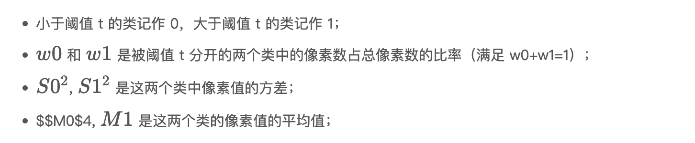
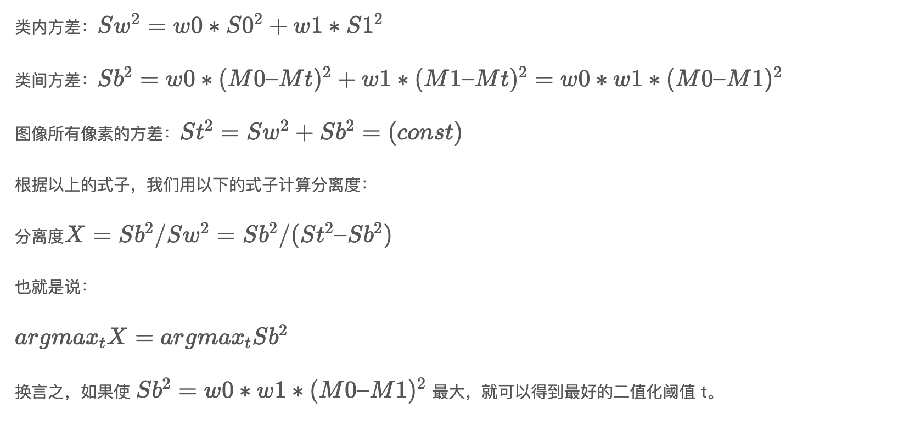

```
title: Linux系统上常用软件集锦
date: 2020-07-20 00:00:00
updated: 2022-01-05 00:00:00
tags: [Linux,四大组件,Activity]
type: [Linux,四大组件,Activity]
comments: Activity的生命周期完全解析
description: Activity的生命周期完全解析
keywords: Activity的生命周期完全解析
top_img:
mathjax:
katex:
aside:
aplayer:
highlight_shrink:
```

[TOC]


# [Opencv大津二值化算法](https://geek-docs.com/opencv/opencv-examples/opencv-dajin-2value.html)

**Opencv大津二值化算法**，也被称作最大类间方差法，是一种可以自动确定二值化中阈值的算法，从类内方差和类间方差的比值计算得来：



也就是说：


