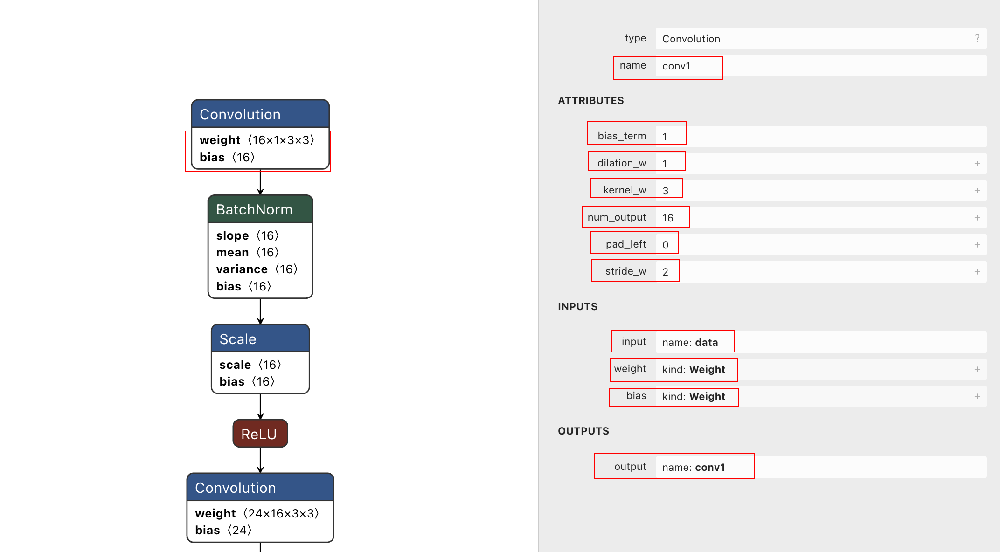

```
title: Linux系统上常用软件集锦
date: 2020-07-20 00:00:00
updated: 2022-01-05 00:00:00
tags: [Linux,四大组件,Activity]
type: [Linux,四大组件,Activity]
comments: Activity的生命周期完全解析
description: Activity的生命周期完全解析
keywords: Activity的生命周期完全解析
top_img:
mathjax:
katex:
aside:
aplayer:
highlight_shrink:
```

[TOC]


文章参考：https://blog.csdn.net/m0_37264397/article/details/124184227





## param文件

```c++
7767517																																			// 版本信息
33 34																																				// layer层（网络层）  以及blob数目
Convolution      conv1            1 1 data conv1 0=16 1=3 2=1 3=2 4=0 5=1 6=144
BatchNorm        conv1/bn1        1 1 conv1 conv1_conv1/bn1 0=16
Scale            conv1/bn2        1 1 conv1_conv1/bn1 conv1_conv1/bn2 0=16 1=1
ReLU             relu1            1 1 conv1_conv1/bn2 conv1_relu1
Convolution      conv2            1 1 conv1_relu1 conv2 0=24 1=3 2=1 3=2 4=0 5=1 6=3456
BatchNorm        conv2/bn1        1 1 conv2 conv2_conv2/bn1 0=24
Scale            conv2/bn2        1 1 conv2_conv2/bn1 conv2_conv2/bn2 0=24 1=1
ReLU             relu2            1 1 conv2_conv2/bn2 conv2_relu2
Convolution      conv3            1 1 conv2_relu2 conv3 0=24 1=1 2=1 3=1 4=0 5=1 6=576
BatchNorm        conv3/bn1        1 1 conv3 conv3_conv3/bn1 0=24
Scale            conv3/bn2        1 1 conv3_conv3/bn1 conv3_conv3/bn2 0=24 1=1
ReLU             relu3            1 1 conv3_conv3/bn2 conv3_relu3
Convolution      conv4            1 1 conv3_relu3 conv4 0=32 1=3 2=1 3=2 4=1 5=1 6=6912
BatchNorm        conv4/bn1        1 1 conv4 conv4_conv4/bn1 0=32
Scale            conv4/bn2        1 1 conv4_conv4/bn1 conv4_conv4/bn2 0=32 1=1
ReLU             relu4            1 1 conv4_conv4/bn2 conv4_relu4
Convolution      conv5            1 1 conv4_relu4 conv5 0=48 1=3 2=1 3=1 4=0 5=1 6=13824
BatchNorm        conv5/bn1        1 1 conv5 conv5_conv5/bn1 0=48
Scale            conv5/bn2        1 1 conv5_conv5/bn1 conv5_conv5/bn2 0=48 1=1
ReLU             relu5            1 1 conv5_conv5/bn2 conv5_relu5
Convolution      conv6_3          1 1 conv5_relu5 conv6_3 0=48 1=1 2=1 3=1 4=0 5=1 6=2304
BatchNorm        conv6_3/bn1      1 1 conv6_3 conv6_3_conv6_3/bn1 0=48
Scale            conv6_3/bn2      1 1 conv6_3_conv6_3/bn1 conv6_3_conv6_3/bn2 0=48 1=1
ReLU             relu6_3          1 1 conv6_3_conv6_3/bn2 conv6_3_relu6_3
Convolution      conv7_3          1 1 conv6_3_relu6_3 conv7_3 0=64 1=3 2=1 3=1 4=0 5=1 6=27648
BatchNorm        conv7_3/bn1      1 1 conv7_3 conv7_3_conv7_3/bn1 0=64
Scale            conv7_3/bn2      1 1 conv7_3_conv7_3/bn1 conv7_3_conv7_3/bn2 0=64 1=1
ReLU             relu7_3          1 1 conv7_3_conv7_3/bn2 conv7_3_relu7_3
InnerProduct     fc3              1 1 conv7_3_relu7_3 fc3 0=256 1=1 2=1638400
ReLU             relu8_3          1 1 fc3 fc3_relu8_3
Dropout          drop3            1 1 fc3_relu8_3 fc3_drop3
InnerProduct     fc_live          1 1 fc3_drop3 live 0=2 1=1 2=512
Softmax          softmax          1 1 live live_softmax 0=0 1=1

```

第一行【7767517】版本信息

第二行【79 87】layer数及blob数  layer数指：input、Convolution、BatchNorm、ReLU。。。 等数目


卷积层调用的模型导入函数是：

```cpp
int Convolution::load_param(const ParamDict& pd)
{
    num_output = pd.get(0, 0);                  // 输出的个数 = 卷积核的个数
    kernel_w = pd.get(1, 0);                    // 卷积核的宽
    kernel_h = pd.get(11, kernel_w);            // 卷积核的高
    dilation_w = pd.get(2, 1);                  // 空洞卷积w方向的膨胀率;目的是增加感受野
    dilation_h = pd.get(12, dilation_w);        // kernel_h′ = kernel_h + (kernel_h − 1) × (dilation_h − 1),
    stride_w = pd.get(3, 1);                    // 卷积滑动步长
    stride_h = pd.get(13, stride_w);
    pad_left = pd.get(4, 0);                    // 填充
    pad_right = pd.get(15, pad_left);
    pad_top = pd.get(14, pad_left);
    pad_bottom = pd.get(16, pad_top);
    pad_value = pd.get(18, 0.f);                // 填充的值
    bias_term = pd.get(5, 0);
    weight_data_size = pd.get(6, 0);            // 权重矩阵的大小 = kernel_w * kernel_h * num_output * channel
    int8_scale_term = pd.get(8, 0);
    activation_type = pd.get(9, 0);
    activation_params = pd.get(10, Mat());
    impl_type = pd.get(17, 0);

    if (int8_scale_term)
    {
        use_int8_inference = true;
    }

    return 0;
}
```


