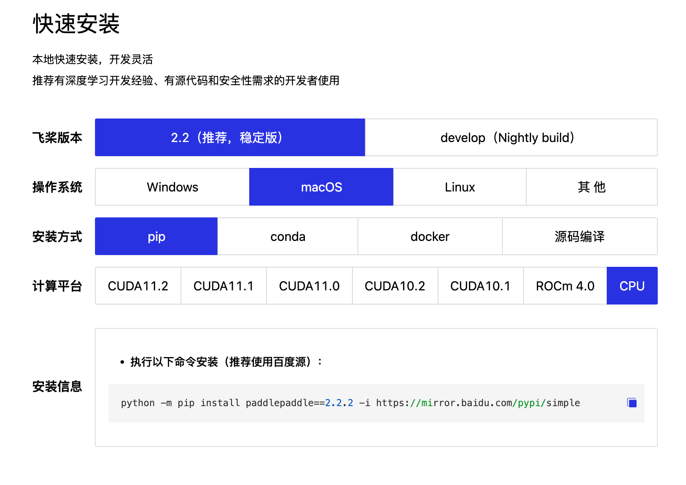

[TOC]

# 概述


## 概述


### 环境搭建

文章参考：https://www.paddlepaddle.org.cn/


```
python -m pip install paddlepaddle==2.3.0 -i https://mirror.baidu.com/pypi/simple

conda install paddlepaddle==2.3.0 --channel https://mirrors.tuna.tsinghua.edu.cn/anaconda/cloud/Paddle/

pip install opencv-python  -i  https://pypi.douban.com/simple

python -m pip install paddlepaddle==2.3.1 -i https://mirror.baidu.com/pypi/simple
```


## PaddlePaddle环境搭建（基于python3.7）


创建Anaconda的开发环境

```
conda create -n paddle_py37 python=3.7

conda activate paddle_py37
```


### pip换清华源

```
pip config set global.index-url https://pypi.tuna.tsinghua.edu.cn/simple
```

### pip显示所有源

```
pip config list
```


### VSCode安装python扩展插件

点击VS Code左侧最后一个按钮，扩展工具，搜索**Python**，**Pylance**进行安装。当然，如果想切换成中文，可以安装Chinese (Simplified)扩展。


## paddle安装指南

PaddlePaddle官网：https://www.paddlepaddle.org.cn/

由于我们使用的是Mac进行计算机视觉模型的训练，所以我们安装CPU的版本：




```shell
python -m pip install paddlepaddle -i https://mirror.baidu.com/pypi/simple
# 安装指定版本的paddlepaddle
python -m pip install paddlepaddle==2.2.2 -i https://mirror.baidu.com/pypi/simple
```

### Paddle安装校验

执行以下的Python代码，检查是否成功调用GPU资源


```
import paddle
paddle.utils.run_check()
```

出现：

```python
(paddle_py37) ➜  NyxPaddlePaddle git:(main) ✗ python           
Python 3.7.13 (default, Mar 28 2022, 07:24:34) 
[Clang 12.0.0 ] :: Anaconda, Inc. on darwin
Type "help", "copyright", "credits" or "license" for more information.
>>> 
>>> 
>>> 
>>> 
>>> 
>>> import paddle
paddle.utils.run_check()
>>> paddle.utils.run_check()
Running verify PaddlePaddle program ... 
PaddlePaddle works well on 1 CPU.
W0410 22:09:46.680740 176391680 fuse_all_reduce_op_pass.cc:76] Find all_reduce operators: 2. To make the speed faster, some all_reduce ops are fused during training, after fusion, the number of all_reduce ops is 2.
PaddlePaddle works well on 2 CPUs.
PaddlePaddle is installed successfully! Let's start deep learning with PaddlePaddle now.
```

**那么恭喜你，环境配置成功啦！**