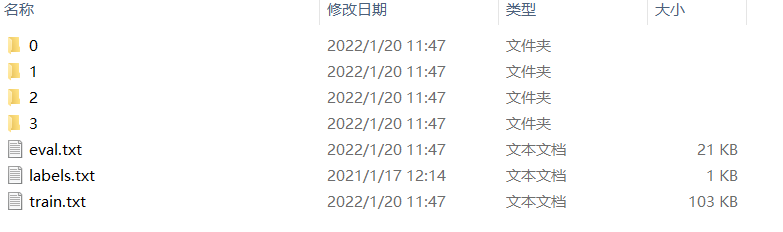

[TOC]

# 概述


文章参考：https://blog.csdn.net/weixin_45747759?spm=1010.2135.3001.5343

文章参考：https://github.com/Monday-Leo/Paddle_tutorial

文章参考：https://www.bilibili.com/video/BV18b4y1J7a6/

## 概述

​	

首先check一下paddle是否安装完成

```shell
(paddle_py37) ➜  NyxPaddlePaddle git:(main) python 01_HelloPaddlePaddle.py 
Running verify PaddlePaddle program ... 
PaddlePaddle works well on 1 CPU.
W0423 20:04:44.033320 234485248 fuse_all_reduce_op_pass.cc:76] Find all_reduce operators: 2. To make the speed faster, some all_reduce ops are fused during training, after fusion, the number of all_reduce ops is 2.
PaddlePaddle works well on 2 CPUs.
PaddlePaddle is installed successfully! Let's start deep learning with PaddlePaddle now.
```


## PaddleX

PaddleX文档: https://github.com/PaddlePaddle/PaddleX

### PaddleX的安装

```
pip install paddlex==2.1.0 -i https://mirror.baidu.com/pypi/simple
```

因为**PaddleX依赖于pycocotools**，如果报错：

```
Microsoft Visual C++ 14.0 is required
```

则需要安装相应工具，下载链接如下：

链接：https://pan.baidu.com/s/17pSEX9ZO28_OIPdaeNAe3A 提取码：xhu4

**如果出现下载预训练模型报错**

```
SSLError("Can't connect to HTTPS URL because the SSL module is not available)
```

需要安装OpenSLL工具，下载链接如下：

链接：https://pan.baidu.com/s/1Z3F9cIH3-6QrsqnAoK-pBw 提取码：ucko


## 数据集

据集下载链接：

链接：https://pan.baidu.com/s/1ZSHQft4eIpYHliKRxZcChQ 提取码：hce7

本次实战为**图片分类任务**，**数据集结构**如下：

[](https://github.com/Monday-Leo/Paddle_tutorial/blob/master/第05讲 实战：PaddleX实现垃圾分类/assets/1.png)

分别为分类的图片文件夹，建议有**一个类别就建一个文件夹**，方便管理。训练集和评价集的标签文件，格式如下：


## 训练

```shell
/Users/frewen/Library/AFrewenLib/anaconda3/envs/paddle_py37/bin/python /Users/frewen/03.ProgramStudy/20.AI/01.WorkSpace/NyxAILearning/NyxPaddlePaddle/rubbish_collectt/train_model.py
/Users/frewen/Library/AFrewenLib/anaconda3/envs/paddle_py37/lib/python3.7/site-packages/paddle/tensor/creation.py:130: DeprecationWarning: `np.object` is a deprecated alias for the builtin `object`. To silence this warning, use `object` by itself. Doing this will not modify any behavior and is safe. 
Deprecated in NumPy 1.20; for more details and guidance: https://numpy.org/devdocs/release/1.20.0-notes.html#deprecations
  if data.dtype == np.object:
2022-04-23 20:37:44 [INFO]	Starting to read file list from dataset...
2022-04-23 20:37:44 [INFO]	6738 samples in file datasets/train.txt
2022-04-23 20:37:44 [INFO]	Starting to read file list from dataset...
2022-04-23 20:37:44 [INFO]	1348 samples in file datasets/eval.txt
2022-04-23 20:37:44 [INFO]	Downloading MobileNetV3_small_x1_0_pretrained.pdparams from https://paddle-imagenet-models-name.bj.bcebos.com/dygraph/legendary_models/MobileNetV3_small_x1_0_pretrained.pdparams
100%|██████████| 17436/17436 [00:00<00:00, 34092.24KB/s]
2022-04-23 20:37:45 [INFO]	Loading pretrained model from output/mobilenetv3_small/pretrain/MobileNetV3_small_x1_0_pretrained.pdparams
2022-04-23 20:37:45 [WARNING]	[SKIP] Shape of pretrained params fc.weight doesn't match.(Pretrained: (1280, 1000), Actual: [1280, 4])
2022-04-23 20:37:45 [WARNING]	[SKIP] Shape of pretrained params fc.bias doesn't match.(Pretrained: (1000,), Actual: [4])
2022-04-23 20:37:45 [INFO]	There are 212/214 variables loaded into MobileNetV3_small_x1_0.


2022-04-23 21:31:29 [INFO]	Model saved in output/mobilenetv3_small/epoch_9.
2022-04-23 21:31:46 [INFO]	[TRAIN] Epoch=10/10, Step=5/105, loss=0.117837, acc1=0.937500, acc4=1.000000, lr=0.000025, time_each_step=3.23s, eta=0:5:23
2022-04-23 21:32:18 [INFO]	[TRAIN] Epoch=10/10, Step=15/105, loss=0.061262, acc1=0.984375, acc4=1.000000, lr=0.000025, time_each_step=3.2s, eta=0:4:48
2022-04-23 21:32:50 [INFO]	[TRAIN] Epoch=10/10, Step=25/105, loss=0.078404, acc1=0.984375, acc4=1.000000, lr=0.000025, time_each_step=3.19s, eta=0:4:15
2022-04-23 21:33:22 [INFO]	[TRAIN] Epoch=10/10, Step=35/105, loss=0.142519, acc1=0.921875, acc4=1.000000, lr=0.000025, time_each_step=3.19s, eta=0:3:43
2022-04-23 21:33:53 [INFO]	[TRAIN] Epoch=10/10, Step=45/105, loss=0.087847, acc1=0.968750, acc4=1.000000, lr=0.000025, time_each_step=3.19s, eta=0:3:11
2022-04-23 21:34:25 [INFO]	[TRAIN] Epoch=10/10, Step=55/105, loss=0.091964, acc1=0.968750, acc4=1.000000, lr=0.000025, time_each_step=3.19s, eta=0:2:39
2022-04-23 21:34:57 [INFO]	[TRAIN] Epoch=10/10, Step=65/105, loss=0.096312, acc1=0.953125, acc4=1.000000, lr=0.000025, time_each_step=3.19s, eta=0:2:7
2022-04-23 21:35:29 [INFO]	[TRAIN] Epoch=10/10, Step=75/105, loss=0.088300, acc1=0.984375, acc4=1.000000, lr=0.000025, time_each_step=3.19s, eta=0:1:35
2022-04-23 21:36:01 [INFO]	[TRAIN] Epoch=10/10, Step=85/105, loss=0.104130, acc1=0.968750, acc4=1.000000, lr=0.000025, time_each_step=3.19s, eta=0:1:3
2022-04-23 21:36:33 [INFO]	[TRAIN] Epoch=10/10, Step=95/105, loss=0.107327, acc1=0.984375, acc4=1.000000, lr=0.000025, time_each_step=3.19s, eta=0:0:31
2022-04-23 21:37:05 [INFO]	[TRAIN] Epoch=10/10, Step=105/105, loss=0.122526, acc1=0.921875, acc4=1.000000, lr=0.000025, time_each_step=3.18s, eta=0:0:0
2022-04-23 21:37:05 [INFO]	[TRAIN] Epoch 10 finished, loss=0.119261615, acc1=0.9607143, acc4=1.0 .
2022-04-23 21:37:05 [INFO]	Start to evaluate(total_samples=1348, total_steps=22)...
2022-04-23 21:37:25 [INFO]	[EVAL] Finished, Epoch=10, acc1=0.966619, acc4=1.000000 .
2022-04-23 21:37:25 [INFO]	Current evaluated best model on eval_dataset is epoch_9, acc1=0.9680397510528564
2022-04-23 21:37:25 [INFO]	Model saved in output/mobilenetv3_small/epoch_10.
```


## 模型的预测

```python
import paddlex as pdx
model = pdx.load_model('output/mobilenetv3_small/best_model')
result = model.predict('188.jpg')
print("Predict Result: ", result)
```


