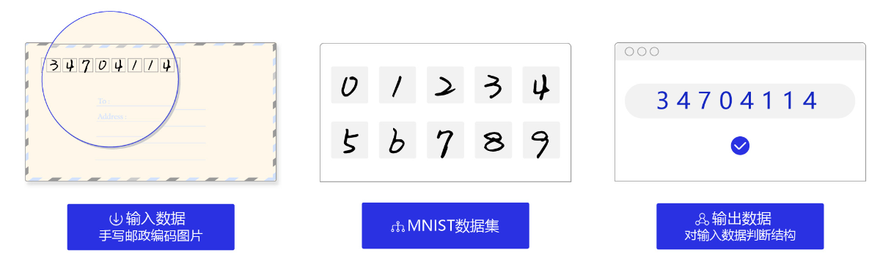

[TOC]

# 概述

**手写数字识别**是计算机视觉的一个**经典项目**，因为**手写数字的随机性**，使用传统的计算机视觉技术**难以找到数字共有特征**。在计算机视觉发展的初期，手写数字识别成为一大难题。

从我们之前讲解的视觉任务分类来看，**手写数字识别是典型的分类任务**，输入一张图片进行**十分类**。在现实生活中，手写数字识别也有非常多的应用场景。如下图，我们看到的**邮编的识别**，可以极大地推动产业自动化，使用卷积神经网络实现的**精度甚至可以超越人类**。

本次任务就是想建立一个模型，输入一张手写数字的图片，就能输出一个正确的分类结果。通过这样的一个实战项目，可以很好地帮我们**巩固和理解我们之前讲过的卷积、池化等常用操作**，也可以温习一下深度学习的基本流程。


<div align="center">

</div>


## 数据准备

手写数字识别有通用的数据集**MNIST**，其中包含已经标注好的几万张手写数字，并且分好了训练集和评价集。如果我们对其中的一张图片进行**可视化**，可以看到这样的画面：

<div align="center">

</div>

图像的shape为（1，28，28），是**单通道图**，图像的大小仅为**28\*28**，它的**标注为7**。

通常对于一般项目来说，需要自己**手写一个Dataloader来依次加载数据，返回图片和标注，供给训练的接口用于训练**。这里考虑到我们入门的原因，直接使用写好的API。有兴趣的同学可以自己尝试不使用高级API，自己下载好压缩包手写一下Dataloader。

```python
train_loader = paddle.io.DataLoader(MNIST(mode='train', transform=ToTensor()), batch_size=10, shuffle=True)
valid_loader = paddle.io.DataLoader(MNIST(mode='test', transform=ToTensor()), batch_size=10)
```

通过上面包装好的API，我们就加载好了**训练集**和**评价集**，可以供训练接口调用。


## 网络搭建

准备好数据之后，第二部也就是**搭建卷积神经网络**，卷积神经网络直接影响着模型的精度，这一步也是**最为关键的一个环节**。本次实战中，我们默认使用**LeNet**。**LeNet**是最早的卷积神经网络之一，**诞生于1998年，在手写数字识别任务中取得了巨大成功**。

<div align="center">

</div>


它的网络结构也非常简单，基本上为**一个卷积层接着一个池化层**，最后通过两个全连接层输出一个[1,10]的矩阵。全连接层我们之前没有介绍过，它通常用于**拟合一些批量数据，比如有很多散点，拟合出一条曲线**。它的结构如下：

<div align="center">

</div>


也就是说**每一个输出和前面一层的所有参数都相关**，它的数学表达其实就是**乘上一个变换矩阵再加上偏差**，得到输出矩阵。**为什么图像中大量使用卷积层，很少使用全连接层呢？这边留给大家课后自己思考。**

​	

**LeNet**使用**Paddle**复现代码如下：

```python
import paddle
import numpy as np
from paddle.nn import Conv2D, MaxPool2D, Linear
import paddle.nn.functional as F

# 定义 LeNet 网络结构
class LeNet(paddle.nn.Layer):
    def __init__(self, num_classes=1):
        super(LeNet, self).__init__()
        self.conv1 = Conv2D(in_channels=1, out_channels=6, kernel_size=5)
        self.max_pool1 = MaxPool2D(kernel_size=2, stride=2)
        self.conv2 = Conv2D(in_channels=6, out_channels=16, kernel_size=5)
        self.max_pool2 = MaxPool2D(kernel_size=2, stride=2)
        self.conv3 = Conv2D(in_channels=16, out_channels=120, kernel_size=4)
        self.fc1 = Linear(in_features=120, out_features=64)
        self.fc2 = Linear(in_features=64, out_features=num_classes)
    def forward(self, x):                        #[N,1,28,28] 
        x = self.conv1(x)                        #[N,6,24,24]
        x = F.sigmoid(x)                         #[N,6,24,24]
        x = self.max_pool1(x)                    #[N,6,12,12]
        x = F.sigmoid(x)                         #[N,6,12,12]
        x = self.conv2(x)                        #[N,16,8,8]
        x = self.max_pool2(x)                    #[N,16,4,4]
        x = self.conv3(x)                        #[N,120,1,1]
        x = paddle.reshape(x, [x.shape[0], -1])  #[N,120]
        x = self.fc1(x)                          #[N,64]
        x = F.sigmoid(x)                         #[N,64]
        x = self.fc2(x)                          #[N,10]
        return x
```


