```
title: Linux系统上常用软件集锦
date: 2020-07-20 00:00:00
updated: 2022-01-05 00:00:00
tags: [Linux,四大组件,Activity]
type: [Linux,四大组件,Activity]
comments: Activity的生命周期完全解析
description: Activity的生命周期完全解析
keywords: Activity的生命周期完全解析
top_img:
mathjax:
katex:
aside:
aplayer:
highlight_shrink:
```

[TOC]


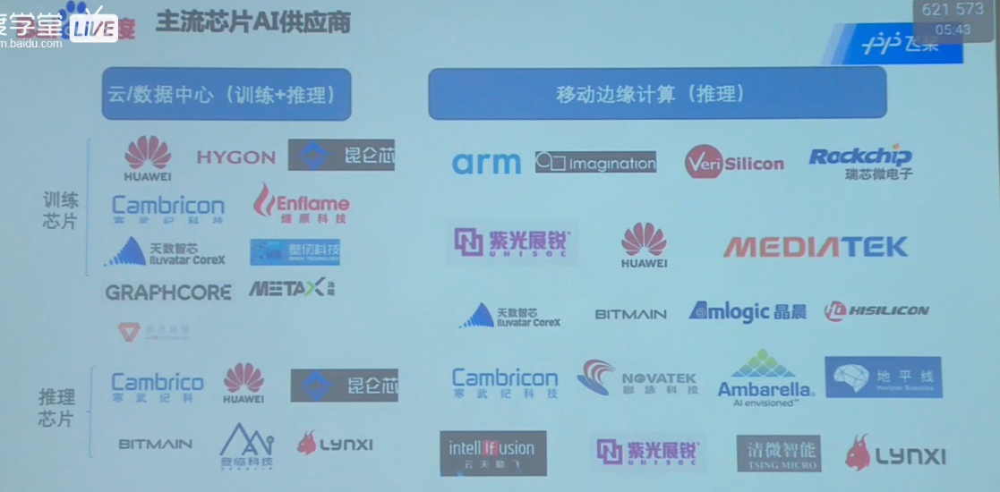


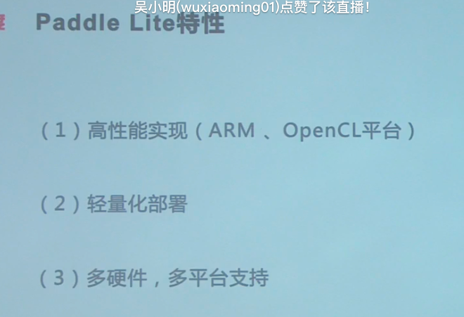


Paddle-Lite特性

高性能实现（ARM、OpenCL平台）

轻量化部署

多硬件、多平台支持


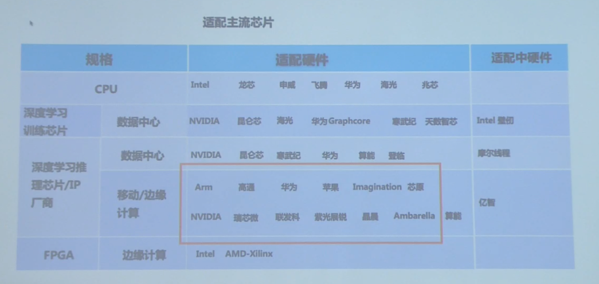


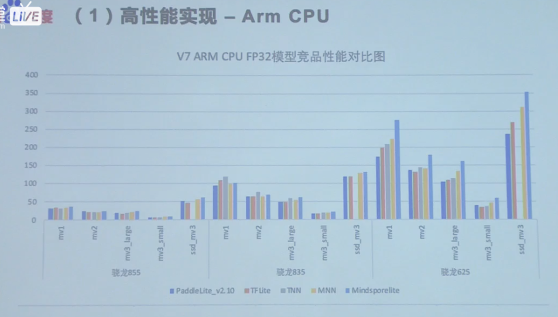


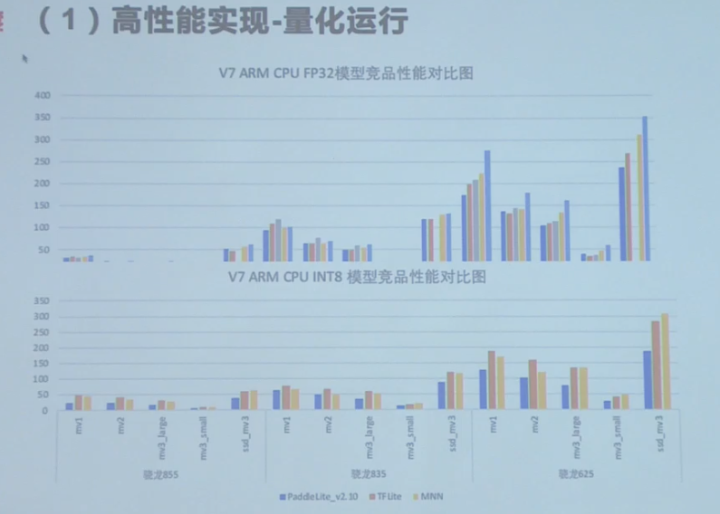


轻量化部署：

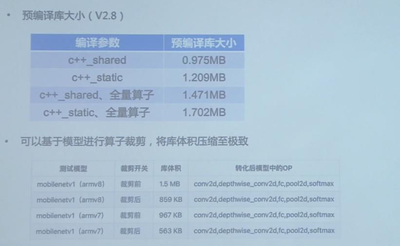


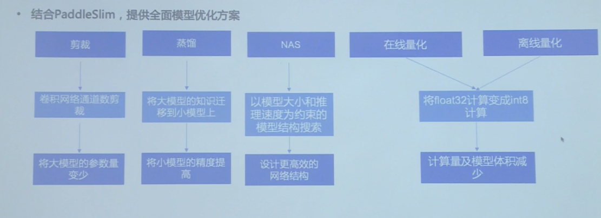


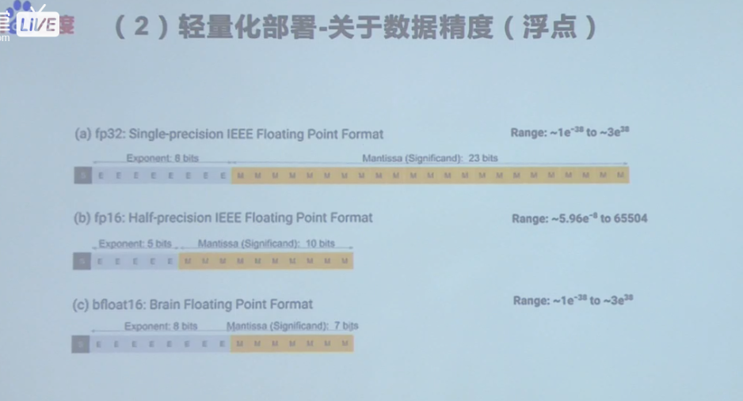

数据对齐的。数据传话。


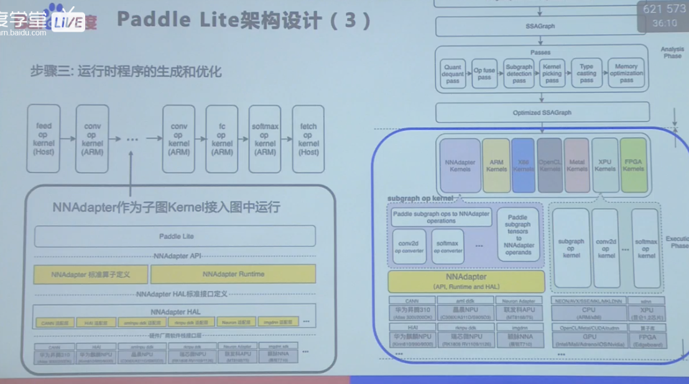


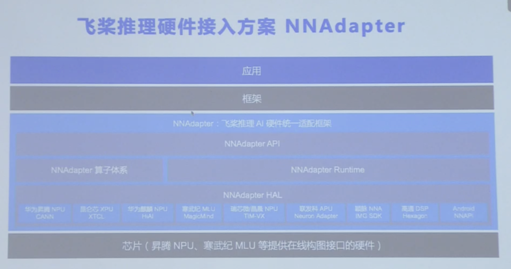


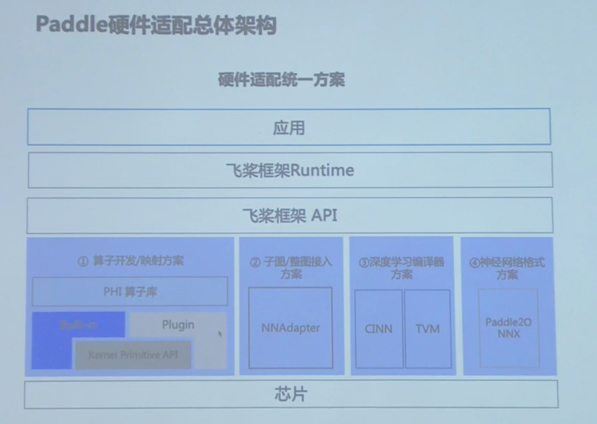


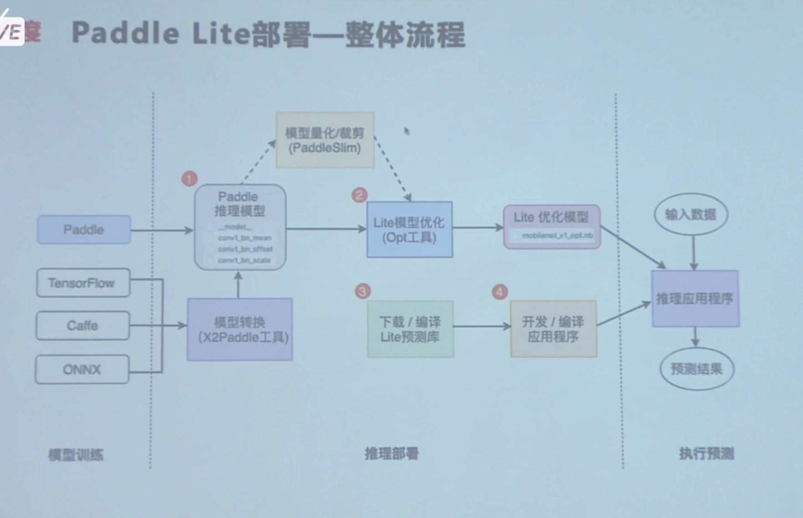


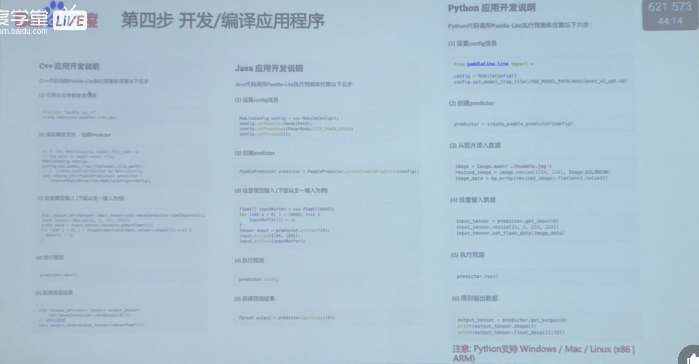


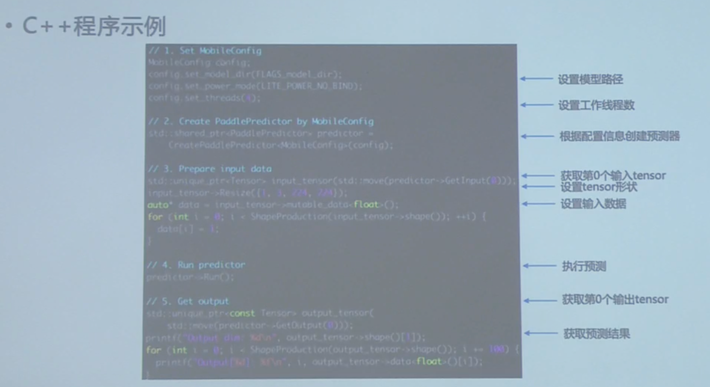


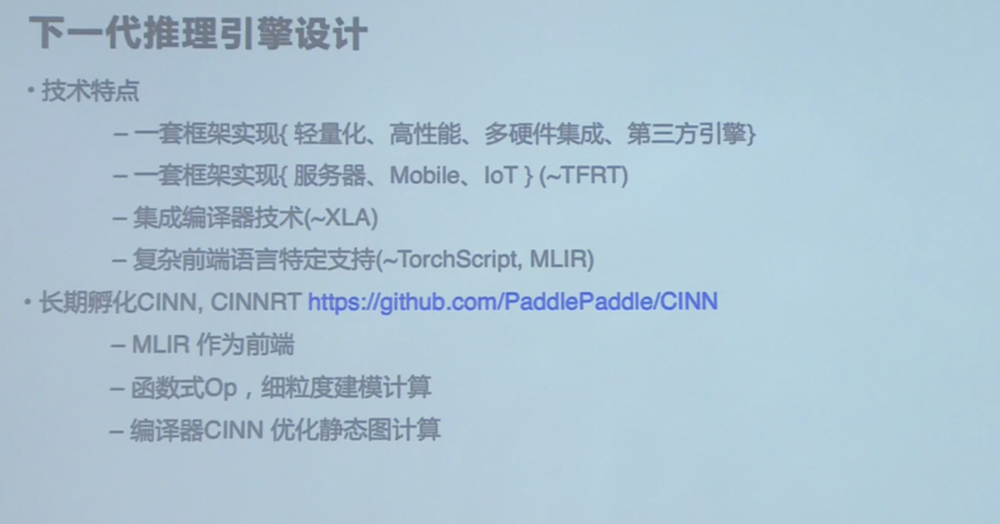


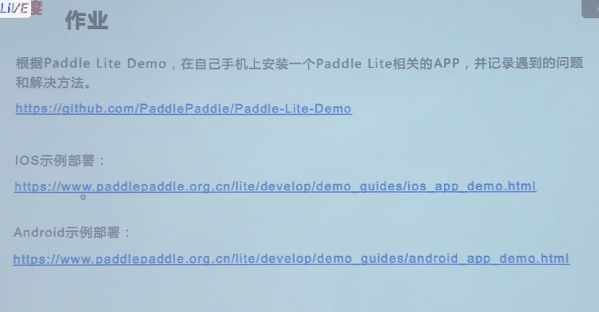