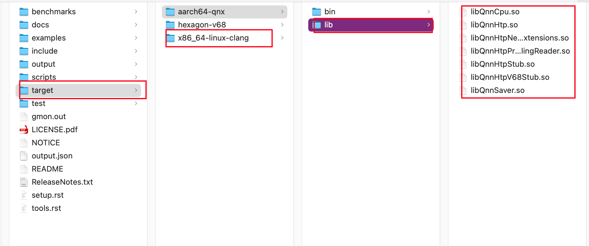
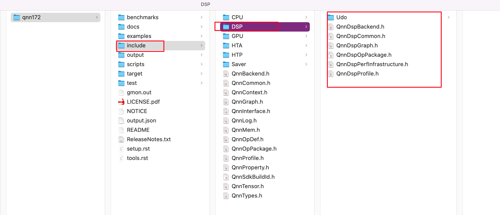

[TOC]

# 概述


QNN SDK提供了几个后端库。这些库可以在<QNN_SDK_ROOT>/target/<target-platform>/lib文件夹中找到。QNN后端库名称以libQnn作为前缀。




本节包含与DSP后端API专门化相关的信息。所有QNN DSP后端专门化都可以在<QNN_SDK_ROOT>/include/DSP/目录下使用。




# 模型转化问题汇总

问题一

https://blog.csdn.net/weixin_46133643/article/details/125373031

```
ModuleNotFoundError: No module named 'packaging'
```

解决方案：

```
pip install packaging
```


问题二：

```
ModuleNotFoundError: No module named 'yaml'
```

```
sudo pip3 install pyyaml
```


问题三：

```
ModuleNotFoundError: No module named 'pandas'
```


