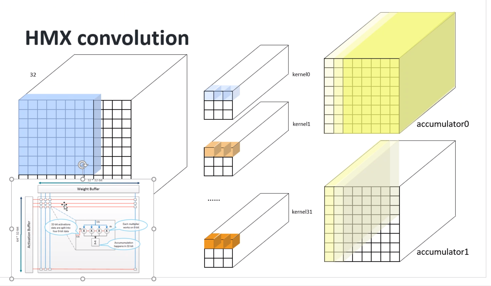
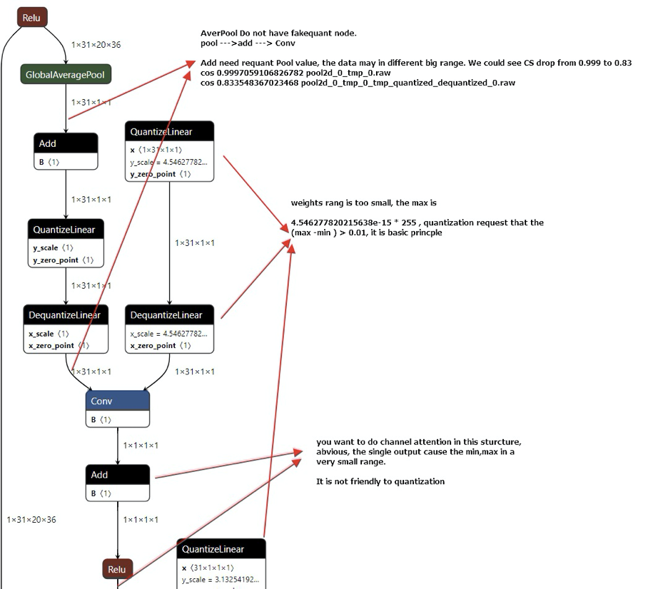

[TOC]

# 概述

本文主要介绍描述了一般的量化过程以及支持的算法和功能。

非量化模型文件使用32位浮点表示网络参数。量化模型文件使用网络参数的定点表示，通常是8位权重和8位或32位偏差。不动点表示与Tensorflow量化模型相同。

QNN可以支持在量化模型或非量化模型之间进行选择

- CPU - 选择非量化模型。量化模型目前与 CPU 后端不兼容。
- DSP - 选择量化模型。在 DSP 后端运行时需要量化模型。
- GPU - 选择非量化模型。量化模型目前与 GPU 后端不兼容。
- HTP - 选择量化模型。在 HTP 后端运行时需要量化模型。
- HTA - 选择量化模型。在 HTA 后端运行时需要量化模型。

本节介绍 QNN 中使用的量化算法背后的概念。当开发人员决定量化图形时，转换器会使用这些概念。

QNN 支持多种量化模式。此处描述了量化的基础知识，无论模式如何。

- 量化使用提供的位宽将浮点数据转换为 Tensorflow 风格的定点格式。
- 满足以下要求：
  - 涵盖了整个输入值范围。
  - 强制执行最小范围 0.01。
  - 浮点零是可以精确表示的。

算法原始模型的QAT模型，算法模型的使用paddlpaddle的模型训练使用的对称量化

QNN则使用的

理论上余弦相似度是：小数点0.999才算达标

## 会议讨论

1. x_scale   y_scale  其实高通没有回答
2. 

Weight  （量化反量化）

Activation

### 激活层

## 两种量化损失：

位置 Weight量化（8比特量化）

节点输出 Activation

## 余弦相似值

​	最好是

怎么去锁定Activation。 

CPU FP32

## SQNR是什么公式？？

量化手段：

量化和反量化

确认是什么损失导致：

perchannel

如果是Activatiion导致。设置成16bit.

训练更稳定。

1.建议去掉BN层

2. 中段加速器，对weight的要求比较高。

对齐32通道  nach

10通道的

2. 

1. fill成一个的卷积

HMX的高速硬件算了。不管拆开还是不拆开

# 量化问题分析

所说的修改量化节点的文件的relu

算法同学提供的量化文件，里面应该没有relu的节点的吧，我看都是卷积层conv的卷积。

像relu、Maxpool这种不是量化写死的逻辑

所以输出的带有relu和maxpool的量化的json文件的是怎么来的？？？

# QNN 模型量化的转换问题

### 去掉SE block

1.算法模型结构中的SE block 算法结构对QNN量化不友好，有大量的精度损失；

类似于图中的模型结构：GlobalAveragePool+Conv(1x1) +Relu+Conv(1x1)+HardSigmoid。这样的结构频繁输出1x1的卷积。对QNN的量化不是很友好。推动算法去掉这样的卷积结构。

In all, this structure causes the whole accuracy loss. I just have one idea but may not useful.

1 Avoid generating (1,1,1,x) output, especially for conv.

I think the main solution sto avoid the loss is do not design such structure, you may try other sstructure to implement “Channel Attention” function. 

Weight 接近于0

高通精度定义为什么要设置0.01

问题主要出现在Attention

#### BN算子

先算卷积   再算BN。

https://www.cnblogs.com/jermmyhsu/p/13508382.html

 

### 裁剪

裁剪到32 或者 64

weight的为0

self-attention

Max- Min的参数

V1.12的版本在

V1.12的ES2的

