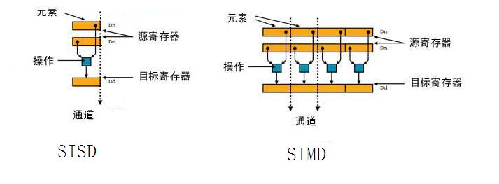
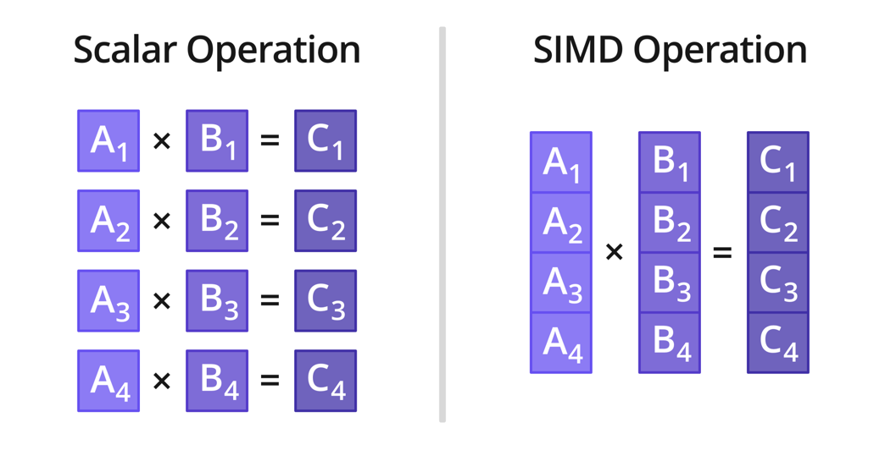

[TOC]

# 概述

文章参考：https://arm-software.github.io/acle/neon_intrinsics/

文章参考：https://developer.arm.com/documentation/102467/0100/

文章参考：https://zhuanlan.zhihu.com/p/358603760

文章参考：https://zhuanlan.zhihu.com/p/143328317

文章参考：https://www.jianshu.com/p/16d60ac56249

文章参考：https://blog.csdn.net/chshplp_liaoping/article/details/12752749

文章参考：http://blog.csdn.net/chshplp_liaoping/article/details/12752749

文章参考：https://github.com/Denislyl/MyTechBlog2/issues/5

文章参考：https://blog.csdn.net/weixin_43475286/article/details/109049895

文章参考：https://blog.csdn.net/Yemiekai/article/details/108009701

文章参考：https://zhuanlan.zhihu.com/p/397551265

文章参考：http://giantpandacv.com/project/%E9%83%A8%E7%BD%B2%E4%BC%98%E5%8C%96/AI%20%E7%A7%BB%E5%8A%A8%E7%AB%AF%E7%AE%97%E6%B3%95%E4%BC%98%E5%8C%96/ARM%20Neon%20Intrinsics%20%E5%AD%A6%E4%B9%A0%E6%8C%87%E5%8C%97%EF%BC%9A%E4%BB%8E%E5%85%A5%E9%97%A8%E3%80%81%E8%BF%9B%E9%98%B6%E5%88%B0%E5%AD%A6%E4%B8%AA%E9%80%9A%E9%80%8F/

https://zhuanlan.zhihu.com/p/441686632


Neon是ARM Cortex-A和Cortex-R系列处理器的计算加速指令集，是AI落地的工程利器。Neon Intrinsics 的出现，缓解了汇编语言难学难写的难题，值得工程师们开发利用。

Neon是ARM平台的向量化计算指令集，通过一条指令完成多个数据的运算达到加速的目的，常用于AI、多媒体等计算密集型任务。NEON 技术是 ARM Cortex™-A 系列处理器的 128 位 SIMD（Single instruction multiple data 单指令，多数据）架构扩展，专门针对大规模并行运算设计的，旨在为消费性多媒体应用程序提供灵活、强大的加速功能，从而显著改善用户体验。

NEON 技术通过加速音频和视频编解码、用户界面、2D/3D图形和游戏来改善多媒体用户体验。NEON 还可以加速信号处理算法，以加快音频和视频处理、声音和面部识别、计算机视觉和深度学习等应用。


# **ARM处理器**

针对每一种ARM架构，ARM都设计了很多的处理器（内核），这里就不列出来了，感兴趣去官网能够查找。这里主要讲讲命名的变化。

主要分为：**经典处理器、Cortex-M系列处理器、Cortex-R系列处理器、Cortex-A系列处理器**

经典处理器都是按照数字命名的，直到ARM11。也就是推出架构v7的时候，ARM公司把产品并分为三大产品线，分别是Cortex-A、Cortex-R和Cortex-M。

近两年推出的cortex-X并不是单独的产品线，它可看做cortex-A的升级版，两者的市场定位是一样的。

**Cortex-A系列处理器是针对高端应用**而设计的，通常应用于智能手机、平板电脑、数字电视和网络设备等。这些处理器拥有高性能、大规模的内存管理单元以及大量的内部缓存，支持多核处理和虚拟化技术。

**Cortex-R系列处理器是针对实时应用**而设计的，通常应用于汽车、工业控制和医疗设备等。这些处理器拥有极低的延迟、高精度的计时器和内部存储器保护机制，能够在实时响应和高可靠性方面表现出色。

**Cortex-M系列处理器是针对低功耗、低成本、嵌入式应用**而设计的，通常应用于传感器、智能家居、工业控制和医疗设备等。这些处理器拥有低功耗、小尺寸和低成本等优点，同时也支持实时性、安全性和可靠性等特性。


ARM CPU 最初只有普通的寄存器，可以进行基本数据类型的基础运算。从 ARMv5 架构开始引入 VFP（vector-floating-point） 指令扩展，可以通过使用短向量指令来加速浮点计算。从 ARMv7 架构开始引入 NEON 技术，NEON 技术同样是依靠向量指令来加速计算。鉴于 NEON 技术提供的向量技术加速效果体验更优秀，从 ARMv7 架构开始使用 VFP 向量指令加速的模式被弃用，因此 VFP 单元有时也称之为 FPU（Floating Point Unit）单元。


# **SIMD概念**

ARM NEON 技术本质上是一种高级的单指令多数据（SIMD）架构扩展，这种扩展仅在一些 ARMv7-A 和 ARMv7-R 架构以及 ARMv8 架构上支持。和 SSE/AVX 类似: 一条指令以指令级SIMD的方式同时对多个数据进行操作，同时，操作的数据个数由向量寄存器的长度和数据类型共同决定。

对于SISD，每个指令只能处理一个数据，而SIMD一个指令可以处理多个数据，因为多个数据的处理是平行的，因此从时间来说，一个指令执行的时间，SISD和SIMD是差不多的。由于SIMD一次可以处理N个数据，所以它的处理的时间也就缩短到SISD的1/N。



需要指出一点，NEON是需要硬件的支持的，需要有一块寄存器放到硬件上来处理这个的。

**SIMD** 特别适用于一些常见的任务，如音频图像处理。大部分现代 CPU 设计都包含了 SIMD 指令，来提高多媒体使用的性能。




如上图所示，标量运算时一次只能对一对数据执行乘法操作，而采用 SIMD 乘法指令，则一次可以对四对数据同时执行乘法操作。


# NEON向量寄存器

NEON 寄存器主要是用来存放包含相同数据类型元素的向量。

在 ARMv7 架构中， 一共有16个128位寄存器，这个128位寄存器也称之为 Q 寄存器，一个128位寄存器又可以分为两个64位寄存器，即一共有32个64位寄存器，64位寄存器又称之为 D 寄存器。

在ARMv8 架构中寄存器的数量相比 ARMv7 架构数量翻倍。Q 寄存器和 D 寄存器对应表如下所示：


NEON SIMD 寄存器的长度为 128 位，如果操作 32 位浮点数，可同时操作 4 个；如果操作 16 位整数（short），可同时操作 8 个；而如果操作 8 位整数，则可同时操作 16 个。


##  AArchh32 / ARMV7向量寄存器

AArch32/Armv7 有 16 个 128bit 的向量寄存器，这些寄存器又可以划分为：

- 16 个128bit 的 Q 寄存器，Q0~Q15。
- 32 个 64bit 的 D 寄存器，D0~D31。
- 64 个 32bit 的 S 寄存器，S0~S63。  TODO  

每种类型寄存器的映射关系如下：

​																					AArch32 SIMD register


ARMv7 NEON 指令集架构具有 16 个 128 位的向量寄存器，命名为 q0～q15。这 16 个寄存器又可以拆分成 32 个 64 位寄存器，命名为 d0～d31。其中qn和d2n，d2n+1是一样的，故使用汇编编写代码时要注意避免产生寄存器覆盖。

有16个128位四字到寄存器Q0-Q15，32个64位双子寄存器D0-D31，两个寄存器是重叠的，在使用到时候需要特别注意，不小心就会覆盖掉。如下图所示：

两个寄存器的关系：Qn =D2n和D2n+1，如Q8是d16和d17的组合。


## AArch64 向量寄存器

AArch64 有 32 个 128bit 的向量寄存器，这些寄存器又可以划分为：

TODO   错误！！！！

- 32 个 128bit 的 V 寄存器，V0~V31。
- 32 个 64bit 的 D 寄存器，D0~D31。
- 32 个 32bit 的 S 寄存器，S0~S31。

每种类型寄存器的映射关系如下：

​																					AArch64 SIMD register


# NEON  intrinsics（NEON内联） 和 NEON assembly（NEON汇编）

intrinsics 是以类似调用 C 语言函数的方法调用 Neon，并由编译器生成最终的二进制代码，assembly 则是手工嵌入 Neon 汇编，直接生成二进制代码。

Intrinsic_C用起来简单，还能跨armv7，armv8，每一个API接口都对应着相应的一条指令。由于充满了sign/unsign，int、short、char，8x8,16x8 ，加 减 乘，长宽，收窄，饱和，位移等等，在arm_neon.h里有几百个Api，但是殊途同归，大同小异，每了解1个汇编指令，就能通吃10~20个Api。
		这里有份帮助文档：https://blog.csdn.net/fengbingchun/article/details/38085781
		汇编代码就不能跨armv7，armv8了，但是真正懂得每个汇编指令的意思，才能优化到极致。懂了汇编，反过来写Intrinsic_C也大有帮助。

TODO 后续我们可以学习一下这两个的区别。

我们现在主要学习的是NEON  intrinsics

如果您想了解的是 Neon assembly，可以参考这篇文章：https://zhuanlan.zhihu.com/p/143328317


# NEON加速应用场景

## Android启用NEON

直接参考 ARM 官方的 Demo 制作教程（还带了演示编写代码的视频）：

**Neon Intrinsics Getting Started on Android**（https://developer.arm.com/solutions/os/android/developer-guides/neon-intrinsics-getting-started-on-android）

**Neon Intrinsics on Android How to Truncate Thresholding and Convolution of A 1D Signal** （https://developer.arm.com/solutions/os/android/developer-guides/neon-intrinsics-on-android-how-to-truncate-thresholding-and-convolution-of-a-1d-signal）

https://developer.android.com/ndk/guides/cpu-arm-neon.html


核心点就是，在 Gradle 加上 Neon 的启用命令（如下红框），然后在 cpp 引用头文件 **#include** ，写代码就完事了。余下的都是带 Native 代码的安卓开发的知识。

```c++
 externalNativeBuild { 
        cmake { 
            cppFlags "-std=c++14" 
            arguments "-DANDROID_ARM_NEON=TRUE" 
        } 
    } 
```

还要在cmake中添加对neon的支持 "-mfpu=neon"

最后在cpp中 #include`<arm_neon.h>`

这样，项目就可以支持neon加速了。


## iOS启用NEON

**关于在 iOS 开发中启用 Neon（Xcode，尝试的版本为 12.3**）：笔者尝试过将 Android 的 NDK 代码迁移至 iOS，在不修改 Xcode 任何设置的情况下，arm_neon.h 可找到，编译可通过，那说明 Xcode 默认打开了 Neon 的启用开关，写就完事了。


## NCNN推理加速库

（https://github.com/Tencent/ncnn/tree/e16b338b136c94805bc7d0ef3756f2dc4bfa3408/src/layer）是腾讯开源，nihui 维护的 AI 推理引擎。2017 开源至今，其代码依然保持着组织结构简单、易重用的优点。ncnn 实现的算子包含普通实现（无针平台的加速）和针对 3 种平台（arm/vulkan/x86）的指令集加速实现（注：可能有的算子有普通实现，但没有平台加速实现，毕竟做加速实现还是比较耗费精力的）。

由于 Neon 实现往往跟循环展开等技巧一起使用，代码往往比较长。我们可以先阅读普通实现的代码实现了解顶层逻辑，再阅读 Neon 实现的代码。例如，我们希望学习全连接层（innerproduct）的 Neon 实现，其普通实现的位置在 ncnn/src/layer/innerproduct.cpp，对应的 Neon 加速实现的位置在 ncnn/src/layer/arm/innerproduct_arm.cpp。


注意代码中出现较多的条件编译。原因我们上文提到过，有的 intrinsics 是较新 Aarch64 架构下专有的，为了兼容较老的 ArmV7a 架构，对于不能用的 intrinsics 只能用多条兼容的 intrinsics 等效替代。为了保证 Aarch64 下的性能同时保证对 ArmV7a 的兼容性，ncnn 采用条件编译的方式处理不兼容的 intrinsics（条件编译就是编译满足条件的分枝的代码，不满足条件的代码将不出现在最终的二进制文件中）。

如果你只关注 Aarch64 平台下的实现，下图 #else 分支的代码跳过不看即可。


## Nvidia carotene 库

了解 **carotene**（https://github.com/opencv/opencv/tree/master/3rdparty/carotene）库的人应该不多，但了解 OpenCV 的人应该不少吧？carotene 能够作为 OpenCV 的第三方库（third party）存在，足以证明其代码质量。

carotene 的组织结构同样简单，且不依赖 OpenCV 的数据结构，想用想学习哪个函数直接提取出来即可。如下图，里面主要用 Neon 实现了色彩空间转换、均值滤波、Canny 边缘检测等常见的图像处理算子。


# 示例Demo

这里以一个小例子来解释如何利用NEON内置函数来加速实现统计一个数组内的元素之和。

以C++代码为例：

原始算法代码如下：

```c++
#include <iostream>
using namespace std;
 
float sum_array(float *arr, int len)
{
    if(NULL == arr || len < 1)
    {
        cout<<"input error\n";
        return 0;
    }
    float sum(0.0);
    for(int i=0; i<len; ++i)
    {
        sum += *arr++;
    }
    return sum;
}

```

对于长度为N的数组，上述算法的时间复杂度时O(N)。
		采用NEON函数进行加速：

```c++

#include <iostream>
#include <arm_neon.h> //需包含的头文件
using namespace std;
 
float sum_array(float *arr, int len)
{
    if(NULL == arr || len < 1)
    {
        cout<<"input error\n";
        return 0;
    }
 	// 进行数组除以4取值
    int dim4 = len >> 2; // 数组长度除4整数
    int left4 = len & 3; // 数组长度除4余数
    float32x4_t sum_vec = vdupq_n_f32(0.0); //定义用于暂存累加结果的寄存器且初始化为0
    for (; dim4>0; dim4--, arr+=4) //每次同时访问4个数组元素
    {
        float32x4_t data_vec = vld1q_f32(arr); //依次取4个元素存入寄存器vec
        sum_vec = vaddq_f32(sum_vec, data_vec);//ri = ai + bi 计算两组寄存器对应元素之和并存放到相应结果
    }
    ////将累加结果寄存器中的所有元素相加得到最终累加值
    float sum = vgetq_lane_f32(sum_vec, 0)+vgetq_lane_f32(sum_vec, 1)+vgetq_lane_f32(sum_vec, 2)+vgetq_lane_f32(sum_vec, 3);
    
    // 将剩下的少于4的数字，依次计算累加即可
    for (; left4>0; left4--, arr++)
        sum += (*arr) ;   //对于剩下的少于4的数字，依次计算累加即可
    return sum;
}
```

下面我们来讲解一下上面的代码：

上述算法的时间复杂度时O(N/4)

从上面的例子看出，使用NEON函数很简单，只需要将依次处理，变为批处理（如上面的每次处理4个）。

上面用到的函数有：

```c++
// 将value复制4份存到返回的寄存器中
float32x4_t vdupq_n_f32 (float32_t value)

// 从数组中依次Load4个元素存到寄存器中(就是将数组的四个元素当道寄存器中)
float32x4_t vld1q_f32 (float32_t const * ptr)
    
// 相应的 有将寄存器中的值写入数组中    
void vst1q_f32 (float32_t * ptr, float32x4_t val)

// 返回两个寄存器对应元素之和(add) r = a+b
float32x4_t vaddq_f32 (float32x4_t a, float32x4_t b)    

// 返回两个寄存器对应元素之差（sub） r = a-b    
float32x4_t vsubq_f32 (float32x4_t a, float32x4_t b)  

// 返回寄存器某一lane的值    
float32_t vgetq_lane_f32 (float32x4_t v, const int lane)    

// 其他常用的函数还有：    
float32x4_t vmulq_f32 (float32x4_t a, float32x4_t b)   // 返回两个寄存器对应元素之积 r = a*b
float32x4_t vmlaq_f32 (float32x4_t a, float32x4_t b, float32x4_t c)  // r = a +b*c
float32x4_t vextq_f32 (float32x4_t a, float32x4_t b, const int n)   // 拼接两个寄存器并返回从第n位开始的大小为4的寄存器 0<=n<=3
// 例如
a: 1 2 3 4
b: 5 6 7 8
vextq_f32(a,b,1) -> r: 2 3 4 5
vextq_f32(a,b,2) -> r: 3 4 5 6
vextq_f32(a,b,3) -> r: 4 5 6 7    
```

参考下面的代码：

```
float32x4_t sum = vdupq_n_f32(0);
float _a[] = {1,2,3,4}, _b[] = {5,6,7,8} ;
float32x4_t a = vld1q_f32(_a), b = vld1q_f32(_b)  ;
float32x4_t sum1 = vfmaq_laneq_f32(sum, a, b, 0);
float32x4_t sum2 = vfmaq_laneq_f32(sum1, a, b, 1);
float32x4_t sum3 = vfmaq_laneq_f32(sum2, a, b, 2);
```

neon各种指令的官方检索和解释可以参考：

https://developer.arm.com/technologies/neon/intrinsics


自己理解并注释的一段代码：

```
float32x4_t _r00 = vld1q_f32(r0);//将r0开头的4个连续地址存放的数据load到neon寄存器
float32x4_t _r10 = vld1q_f32(r1);
float32x4_t _r20 = vld1q_f32(r2);
float32x4_t _r30 = vld1q_f32(r3);
 
float32x4_t _sum = vmulq_f32(_r00, _k0123);//两个参数的点乘
_sum = vmlaq_f32(_sum, _r10, _k3456);//_sum + _r10 .* _k3456, 点对点操作
_sum = vmlaq_f32(_sum, _r20, _k6789);
 
float32x4_t _sum2 = vmulq_f32(_r10, _k0123);
_sum2 = vmlaq_f32(_sum2, _r20, _k3456);
_sum2 = vmlaq_f32(_sum2, _r30, _k6789);
 
_sum = vsetq_lane_f32(*outptr, _sum, 3);//*outptr赋值给将_sum中index为3的元素（即最后一个），为累加做准备
_sum2 = vsetq_lane_f32(*outptr2, _sum2, 3);
 
float32x2_t _ss = vadd_f32(vget_low_f32(_sum), vget_high_f32(_sum));//将128位寄存器中高64的两个参数与低68位的两个参数对应相加
float32x2_t _ss2 = vadd_f32(vget_low_f32(_sum2), vget_high_f32(_sum2));
 
float32x2_t _sss2 = vpadd_f32(_ss, _ss2);//adds adjacent pairs of elements of two vectors
 
*outptr = vget_lane_f32(_sss2, 0);//get 0th parameter in vector
                    *outptr2 = vget_lane_f32(_sss2, 1);
```


为了比较性能，现在用neon和纯C方法比较一下将彩色图片转成灰度的时间

```c++
//纯C函数
void method_argb2gray_c(AndroidBitmapInfo info, void *pixels) {
    // rgb转灰度值公式
    // Gray = (R*38 + G*75 + B*15) >> 7
    cv::TickMeter tm1;
    tm1.start();
    uint32_t *pixel = NULL;
    int a = 0, r = 0, g = 0, b = 0;
    int rows=info.height;
    int cols=info.width;

    for (int y = 0; y < rows; ++y) {
        for (int x = 0; x < cols; ++x) {
            pixel = (uint32_t *) pixels + info.width * y + x;
            a = (*pixel & 0xFF000000) >> 24;
            r = (*pixel & 0x00FF0000) >> 16;
            g = (*pixel & 0x0000FF00) >> 8;
            b = (*pixel & 0x000000FF) >> 0;
            int gray = (r * 38 + g * 75 + b * 15) >> 7;

            *pixel = ((a << 24) | (gray << 16) | (gray << 8) | gray);
        }
    }
    tm1.stop();
    LOGI("method_argb2gray_c      time: %lf", tm1.getTimeMilli());
}
```


```c++
//neon函数
void method_argb2gray_neon(AndroidBitmapInfo info, void *pixels) {
    // Gray = (R*38 + G*75 + B*15) >> 7
    TickMeter tm3;
    tm3.start();
    unsigned short *dst = (unsigned short *) pixels;
    unsigned char *src = (unsigned char *) pixels;
    uint8x8_t r = vdup_n_u8(38);
    uint8x8_t g = vdup_n_u8(75);
    uint8x8_t b = vdup_n_u8(15);
    uint16x8_t alp = vdupq_n_u16(255 << 8);

    uint16x8_t temp;
    uint8x8_t gray;
    uint8x8x4_t argb;
    uint16x8_t hight;
    uint16x8_t low;
    uint16x8x2_t res;
    int i, size = info.height * info.width / 8;

    for (i = 0; i < size; ++i) {

        //获取r、g、b值，计算灰度值
        argb = vld4_u8(src);
        temp = vmull_u8(argb.val[1], r);
        temp = vmlal_u8(temp, argb.val[2], g);
        temp = vmlal_u8(temp, argb.val[3], b);
        gray = vshrn_n_u16 (temp, 7);
        src += 8 * 4;

        //赋值4通道argb
        hight = vorrq_u16(alp, vmovl_u8(gray));
        low = vorrq_u16(vshlq_n_u16(vmovl_u8(gray), 8), vmovl_u8(gray));
        res = vzipq_u16(low, hight);
        vst1q_u16(dst, res.val[0]);
        dst += 8;
        vst1q_u16(dst, res.val[1]);
        dst += 8;

    }
    tm3.stop();
    LOGI("method_argb2gray_neon   time: %lf", tm3.getTimeMilli());
} 
```


