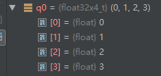
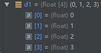
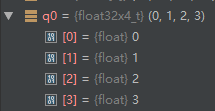
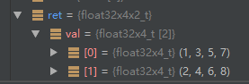
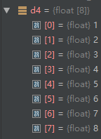
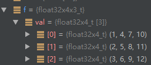
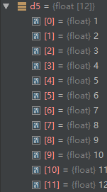
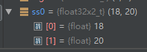

[TOC]

# 概述

文章参考：http://blog.csdn.net/may0324/article/details/72847800

文章参考：https://blog.csdn.net/fengbingchun/article/details/38085781

# 代码示例

NEON 技术是 ARM Cortex™-A 系列处理器的 128 位 SIMD（单指令，多数据）架构扩展，旨在为消费性多媒体应用程序提供灵活、强大的加速功能，从而显著改善用户体验。它具有 32 个寄存器，64 位宽（双倍视图为 16 个寄存器，128 位宽。）
目前主流的iPhone手机和大部分android手机都支持ARM NEON加速，因此在编写移动端算法时，可利用NEON技术进行算法加速，以长度为4的寄存器大小为例，相应的提速倍数约是原始的4倍。

NEON 指令可执行“打包的 SIMD”处理：

1. 寄存器被视为同一数据类型的元素的矢量 
2. 数据类型可为：签名/未签名的 8 位、16 位、32 位、64 位单精度浮点 
3. 指令在所有通道中执行同一操作


# float32x4_t

本文主要介绍float32x4_t相关的结构及函数

float32x4_t 可以理解为vector`<float32`> (4),   同理typexN_t即为vector`<type`>(N)。

在NEON编程中，对单个数据的操作可以扩展为对寄存器，也即同一类型元素矢量的操作，因此大大减少了操作次数。
这里以一个小例子来解释如何利用NEON内置函数来加速实现统计一个数组内的元素之和。


原始算法代码如下：

```c++
float d0[4] = {0.f, 1.f, 2.f, 3.f};
float d1[4] = {4.f, 5.f, 6.f, 7.f};
float d2[4] = {8.f, 9.f, 10.f, 11.f};
float d3[4] = {12.f, 13.f, 14.f, 15.f};
```


```c++
v<mod><opname><shape><flags>_<type>
  
// mod:
// q：表示饱和计算，即当计算结果溢出时，结果取类型范围内的最大值或最小值，例如
// a加b的结果做饱和计算
// int8x8_t vqadd_s8(int8x8_t a, int8x8_t b); 
// a减b的结果右移一位
// int8x8_t vhsub_s8(int8x8_t a, int8x8_t b); 
// d：表示加倍计算，例如
// a乘b的结果扩大一倍, 最后做饱和操作
// int32x4_t vqdmull_s16(int16x4_t a, int16x4_t b); 
// r：表示舍入计算，例如
// 将a与b的和减半,同时做rounding 操作, 每个通道可以表达为: (ai + bi + 1) >> 1
// int8x8_t vrhadd_s8(int8x8_t a, int8x8_t b); 
// p：表示pairwise计算。例如
// 将a, b向量的相邻数据进行两两和操作
// int8x8_t vpadd_s8(int8x8_t a, int8x8_t b);

// opname:
// 表示具体操作，如加法：add；减法：sub；乘法：mul；加载数据：ld；读取数据：st

// shape: 计算形式
// l：表示long，输出向量的元素长度是输入长度的2倍，例如
// uint16x8_t vaddl_u8(uint8x8_t a, uint8x8_t b);
// n：表示 narrow，输出向量的元素长度是输入长度的1/2倍，例如
// uint32x2_t vmovn_u64(uint64x2_t a);
// w：表示 wide，第一个输入向量和输出向量类型一样，且是第二个输入向量元素长度的2倍，例如
// uint16x8_t vsubw_u8(uint16x8_t a, uint8x8_t b);
// _high**：AArch64专用，而且和 l/n 配合使用。
// - 当使用 **l(Long)** 时，表示输入向量只有高 64bit 有效；
// - 当使用 **n(Narrow)** 时，表示输出只有高 64bit 有效。
// a 和 b 只有高 64bit 参与运算
// int16x8_t vsubl_high_s8(int8x16_t a, int8x16_t b);
// _n**：表示有标量参与向量计算，例如
// 向量 a 中的每个元素右移 n 位
// int8x8_t vshr_n_s8(int8x8_t a, const int n);
// _lane**： 指定向量中某个通道参与向量计算，例如
// 取向量 v 中下标为 lane 的元素与向量 a 做乘法计算
// int16x4_t vmul_lane_s16(int16x4_t a, int16x4_t v, const int lane);

// flags: 寄存器长度
// q：寄存器长度，若存在q时，表示使用128位的寄存器，否则使用64位寄存器。

// type: 表示单个通道的数据类型
// 有`u8`、`s8`、`u16`、`s16`、`u32`、`s32`、`f32`、`f64`。（s表示int）
```


# 基本加载存储操作

## vld1q_f32

从128位寄存器中 加载 d0 地址起始的 4 个 float 数据到 q0（128位寄存器中是q0-q15）

```c++
float32x4_t q0 = vld1q_f32(d0); // 从128位寄存器中 加载 d0 地址起始的 4 个 float 数据到 q0（128位寄存器中是q0-q15）
```



## vst1q_f32

```c++
vst1q_f32(d1, q0);// 将 q0 中 4 个 float32，赋值给以 d1 为起始地址的 4 个 float32
```




## vld2q_f32 

```c++
float d4[8]= {1.f, 2.f, 3.f, 4.f, 5.f, 6.f, 7.f, 8.f};
float32x4x2_t ret = vld2q_f32 (d4);
```



## vst2q_f32

```c++
vst2q_f32 (d4, ret);
```



注意，由于寄存器是交错存储的，所以内存保持不变！

## vld3q_f32

```c++
float d5[12] = {1.f, 2.f, 3.f, 4.f,
5.f, 6.f, 7.f, 8.f,
9.f, 10.f, 11.f, 12.f};
float32x4x3_t f = vld3q_f32 (d5);
```




## vst3q_f32

```c++
vst3q_f32 (d5, f);
```



## vld4q_f32, vst4q_f32


# 特殊操作

vadd_type常规加法

vaddl_type支撑长整型操作

vaddw_type支持宽整型操作

vhadd_type将结果减半

vrhadd_type将结果减半后舍入(因为减半后会带入小数)。


vaddq_type, 和vadd_type类似，只是使用的寄存器不同。 vaddq_type使用的是128位寄存器，vadd_type使用的是64位值寄存器。

vaddhn_type支持窄型计算，将四字节加法转换为双字节结果, 该计算会返回四字节的上半部分, vraddhn_type支持结果舍入

## vdupq_n_f32

```c++
float32x4_t res = vdupq_n_f32(0.f); // 存储的四个 float32 都初始化为 0
```


# 基本的算术运算

## vadd_f32

```c++
float32x2_t ss0 = vadd_f32(vget_low_f32(q2), vget_high_f32(q2)); //对应元素相加
```



## vaddq_f32

```
float32x4_t q4 = vaddq_f32 (q1, q2);
```


# 函数汇总

文章参考：https://developer.arm.com/architectures/instruction-sets/intrinsics

文章参考：https://arm-software.github.io/acle/neon_intrinsics/advsimd.html

