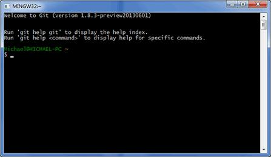

# 概述


# Git环境安装

## Linux上安装Git

 首先，你可以试着输入git，看看系统有没有安装Git：

```shell
# Ubuntu系统：
$ git
The program 'git' is currently not installed. You can install it by typing:
$ sudo apt-get install git

#CentOS系统：
yum install git
```


像上面的命令，有很多Linux会友好地告诉你Git没有安装，还会告诉你如何安装Git。

如果你碰巧用Debian或Ubuntu Linux，通过一条sudo apt-get install git就可以直接完成Git的安装，非常简单。

老一点的Debian或Ubuntu Linux，要把命令改为sudo apt-get install git-core，因为以前有个软件也叫GIT（GNU Interactive Tools），结果Git就只能叫git-core了。由于Git名气实在太大，后来就把GNU Interactive Tools改成gnuit，git-core正式改为git。

如果是其他Linux版本，可以直接通过源码安装。先从Git官网下载源码，然后解压，依次输入：./config，make，sudo make install

```shell
./config

make

sudo make install
```

这几个命令安装就好了。


## **MacOS上安装Git**

写代码肯定是需要 Git 环境的，mac 下安装 Git 用 brew 就好了,不过有可能你的 mac 在安装 xcode 等工具的时候就已经安装好了 Git，所以先验证下

```shell
git -v  #若显示版本号则已经安装过了 Git
```

如果你正在使用Mac做开发，有两种安装Git的方法。

**第一种：**

 一是安装homebrew，然后通过homebrew安装Git，具体方法请参考homebrew的文档：http://brew.sh/。

```shell
brew install git // 安装 git

brew upgrade git // 更新 git

brew uninstall git // 卸载 git
```


**第二种：**

直接从AppStore安装Xcode，Xcode集成了Git，不过默认没有安装，你需要运行Xcode，选择菜单“Xcode”->“Preferences”，在弹出窗口中找到“Downloads”，选择“Command Line Tools”，点“Install”就可以完成安装了。    安装完成之后，直接在命令行里面输入git --version

```shell
FreweniMac:~ frewen$ git --version
git version 2.15.2 (Apple Git-101.1)
FreweniMac:~ frewen$ 
```

### 查看git安装路径

安装完成后给 Git 配置全局环境变量，以方便使用, 如果是通过鼠标点击安装包/UI界面方式 安装，则它会自动配置环境变量。

```shell
whereis git // 可用来查看安装位置
```


## **Windows上安装Git**

实话实说，Windows是最烂的开发平台，如果不是开发Windows游戏或者在IE里调试页面，一般不推荐用Windows。不过，既然已经上了微软的贼船，也是有办法安装Git的。

Windows下要使用很多Linux/Unix的工具时，需要Cygwin这样的模拟环境，Git也一样。Cygwin的安装和配置都比较复杂，就不建议你折腾了。不过，有高人已经把模拟环境和Git都打包好了，名叫msysgit，只需要下载一个单独的exe安装程序，其他什么也不用装，绝对好用。

 msysgit是Windows版的Git，从https://git-for-windows.github.io下载（网速慢的同学请移步国内镜像），然后按默认选项安装即可。

具体的安装教程：https://blog.csdn.net/qq_32786873/article/details/80570783

安装完成后，在开始菜单里找到“Git”->“Git Bash”，蹦出一个类似命令行窗口的东西，就说明Git安装成功！




# Git初次配置

配置git的环境变量

配置全局的用户名和邮箱，之后，我们可以查看一下。

```shell
$ git config --list

# 设置当前项目的邮箱和用户名
git config user.name Frewen.Wang
git config  user.email frewen1225@gmail.com
git config --list

# 设置全局的邮箱和用户名
FreweniMac:~ frewen$ git config --global user.name Frewen.Wang
FreweniMac:~ frewen$ git config --global user.email frewen1225@gmail.com
FreweniMac:~ frewen$ git config --list
credential.helper=osxkeychain
user.name=Frewen.Wong
user.email=frewen1225@gmail.com
```


因为Git是分布式版本控制系统，所以，每个机器都必须自报家门：你的名字和Email地址。你也许会担心，如果有人故意冒充别人怎么办？这个不必担心，首先我们相信大家都是善良无知的群众，其次，真的有冒充的也是有办法可查的。注意git config命令的--global参数，用了这个参数，表示你这台机器上所有的Git仓库都会使用这个配置，当然也可以对某个仓库指定不同的用户名和Email地址。


安装完成之后，我们还需要设置公钥和私钥，这个步骤是很有必要的，因为我们将来无论往哪个仓库提交代码，都是需要提供我们的公钥的。

```shell
ssh-keygen -t rsa -C FreweniUbuntu

#输出的对应信息如下：
FreweniMac:~ frewen$ ssh-keygen -t rsa -C FreweniMacKey
Generating public/private rsa key pair.
Enter file in which to save the key (/Users/frewen/.ssh/id_rsa): 
Created directory '/Users/frewen/.ssh'.
Enter passphrase (empty for no passphrase): 
Enter same passphrase again: 
Your identification has been saved in /Users/frewen/.ssh/id_rsa.
Your public key has been saved in /Users/frewen/.ssh/id_rsa.pub.
The key fingerprint is:
SHA256:PZBSQvCcI5uXRNReSfwYEx6V1Jhn+o3AFrx0Hg70BM0 Frewen.Wong
The key's randomart image is:
+---[RSA 2048]----+
|    .+=..o+B=O.  |
|     + +.o*.OoE  |
|    . B.o..B @.. |
|     = +.o. B o  |
|    o o S o. o o |
|     .     .  o .|
|                 |
|                 |
|                 |
+----[SHA256]-----+
FreweniMac:~ frewen$ 
FreweniMac:~ frewen$ cat ~/.ssh/id_rsa.pub 
ssh-rsa AAAAB3NzaC1yc2EAAAADAQABAAABAQDDwwe2sJ5dW269cBFSupiQAQSw4W7sEUiLXo1M4hHLFQ
1/HsZVyz75tbYBX6WIdwT8jEl3tJJNku5nIPI9MsudklWssR3T32gTZ32yuvF7b005kBGA5RE/oj/nfbLFB9Ubkakyyi
7o+e7CPVTARGuTdz4VraVpp/NXrnTD5tzexXcTOAgA1fm5KApi2z54hgyKXhI7vl3nT36WzO0+u1lXbmHAd6rRZ8X6+2QB278Fd7caiY
fr3AzmT+gCTsoaW9nPvpNGiP06Wr2jYCQ7YuaP9azPzKYWM2X7pKhXESTadtmQakFnfiMOPX92GGmOcbzX6zyc6JxvFwWXt161nq15 
FreweniMacKey
```


现在既然安装完毕，那么我们来看一下git上面常用的一些命令吧！


### 测试Git配置

安装成功之后，我们可以将我们的公钥SSHKeys 添加到GitHub上，我们可以测试一下链接

```shell
FreweniMac:~ frewen$ ssh -T git@github.com
FreweniMac:~ frewen$ ssh -T git@github.com

Hi FrewenWong! You've successfully authenticated, but GitHub does not provide shell access.
```

