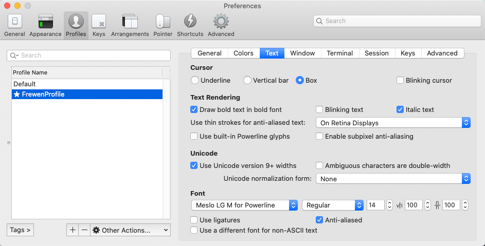

# 概述

文章参考：https://www.cnblogs.com/xishuai/p/mac-iterm2.html

# 安装 iTerm2

## 官网安装

下载地址：https://www.iterm2.com/downloads.html

下载的是压缩文件，解压后是执行程序文件，你可以直接双击，或者直接将它拖到 Applications 目录下。

## Homebrew安装

或者你可以直接使用 Homebrew 进行安装：

```shell
# 建议使用下方方法
$ brew install --cask iterm2

$ brew install --cask iterm2 --force
```

## 安装问题排查

问题一

```shell
Last login: Thu Jun 29 23:29:05 on ttys000
frewen@FreweniMac ~ % brew install --cask iterm2
==> Downloading https://mirrors.tuna.tsinghua.edu.cn/homebrew-bottles/api/cask.jws.json
##=O#-  #                                                                                                      
==> Downloading https://iterm2.com/downloads/stable/iTerm2-3_4_19.zip
######################################################################################################### 100.0%
==> Installing Cask iterm2
==> Moving App 'iTerm.app' to '/Applications/iTerm.app'
fatal: not in a git directory
Error: Command failed with exit 128: git
```

解决此问题：

```shell
brew cask install iterm2 --force
```


# 配置 iTerm2 主题


iTerm2 最常用的主题是 Solarized Dark theme，下载地址：http://ethanschoonover.com/solarized


下载的是压缩文件，你先解压一下，然后打开 iTerm2，按Command + ,键，打开 Preferences 配置界面，然后

```shell
Profiles -> Colors -> Color Presets -> Import
```
选择刚才解压的

```shell
solarized->iterm2-colors-solarized->Solarized Dark.itermcolors
```

文件，导入成功，最后选择 Solarized Dark 主题，就可以了。

# 安装ZSH


查看电脑的系统中是否安装了ZSH。目前最新的Mac电脑已经安装了 ZSH。显示的安装系统如下：


```shell
(base) frewen@FreweniMacBook Downloads % zsh --version
zsh 5.8 (x86_64-apple-darwin20.0)

(base) frewen@FreweniMacBook Downloads % cat /etc/shells
# List of acceptable shells for chpass(1).
# Ftpd will not allow users to connect who are not using
# one of these shells.

/bin/bash
/bin/csh
/bin/dash
/bin/ksh
/bin/sh
/bin/tcsh
/bin/zsh
```

如果没有安装，则使用下面的安装方法进行安装ZSH


```shell
curl	sh -c "$(curl -fsSL https://raw.githubusercontent.com/ohmyzsh/ohmyzsh/master/tools/install.sh)"

wget	sh -c "$(wget -O- https://raw.githubusercontent.com/ohmyzsh/ohmyzsh/master/tools/install.sh)"

fetch	sh -c "$(fetch -o - https://raw.githubusercontent.com/ohmyzsh/ohmyzsh/master/tools/install.sh)"
```


安装好之后，需要把 Zsh 设置为当前用户的默认 Shell（这样新建标签的时候才会使用 Zsh）：


```shell
$ chsh -s /bin/zsh
```


# 安装oh-my-zsh


```shell
sh -c "$(curl -fsSL https://raw.github.com/ohmyzsh/ohmyzsh/master/tools/install.sh)"
```

地址容易被墙，请使用国内的镜像更为使用国内的项目地址

项目mirror地址: https://gitee.com/mirrors/oh-my-zsh

```shell
sh -c "$(curl -fsSL https://gitee.com/shmhlsy/oh-my-zsh-install.sh/raw/master/install.sh)"


sh -c "$(wget -O- https://gitee.com/shmhlsy/oh-my-zsh-install.sh/raw/master/install.sh)"

```

## 配置ZSH的主题

通过如下命令可以查看可用的Theme：


```shell
# ls ~/.oh-my-zsh/themes
```

编辑~/.zshrc文件，将ZSH_THEME="candy",即将主题修改为candy。我采用的agnoster。

然后，我们编辑文件，将主题配置修改为ZSH_THEME="agnoster"。

```shell
vim ~/.zshrc

open -e ~/.zshrc
```


## 设置iTerm2的字体

我在oh-my-zsh的里面使用的主题：

```shell
ZSH_THEME="agnoster"
```

应用这个主题需要特殊的字体支持，否则会出现乱码情况，这时我们来配置字体：

## 下载 Meslo 字体

下载地址：https://github.com/powerline/fonts/blob/master/Meslo%20Slashed/Meslo%20LG%20M%20Regular%20for%20Powerline.ttf

1.使用[Meslo](https://github.com/powerline/fonts/blob/master/Meslo%20Slashed/Meslo%20LG%20M%20Regular%20for%20Powerline.ttf)字体，点开连接点击 view raw 下载字体。

2.安装字体到系统字体册。

3.应用字体到iTerm2下，设置自己喜欢看着舒服的字号，我设置的14px（iTerm -> Preferences -> Profiles -> Text -> Change Font）。




## ZSH插件安装

文章参考：https://segmentfault.com/a/1190000039860436


我们可以搜集一些我们比较喜欢的插件。 我们可以进入到对应的oh-my-zsh的目录里面：

```
cd ~/.oh-my-zsh/custom/plugins
```
在对应的Plugin目录里面执行下面的脚本。进行下载安装

```shell
// zsh-syntax-highlighting高亮插件
git clone https://github.com/zsh-users/zsh-syntax-highlighting.git ${ZSH_CUSTOM:-~/.oh-my-zsh/custom}/plugins/zsh-syntax-highlighting

// zsh-autosuggestions自动补全插件
git clone https://github.com/zsh-users/zsh-autosuggestions ${ZSH_CUSTOM:-~/.oh-my-zsh/custom}/plugins/zsh-autosuggestions

// autojump插件
git clone git://github.com/wting/autojump.git
cd autojump
./install.py or ./uninstall.py 进行安装或者卸载

```

在 ~/.zshrc 中配置

```shell
plugins=(git zsh-syntax-highlighting zsh-autosuggestions autojump)
```


