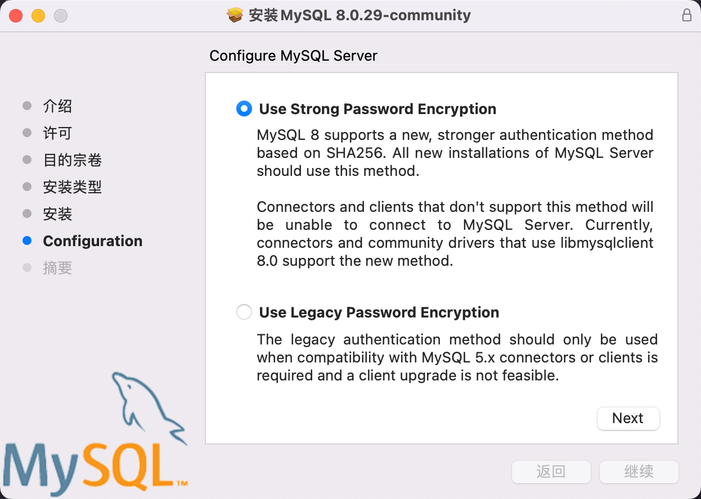
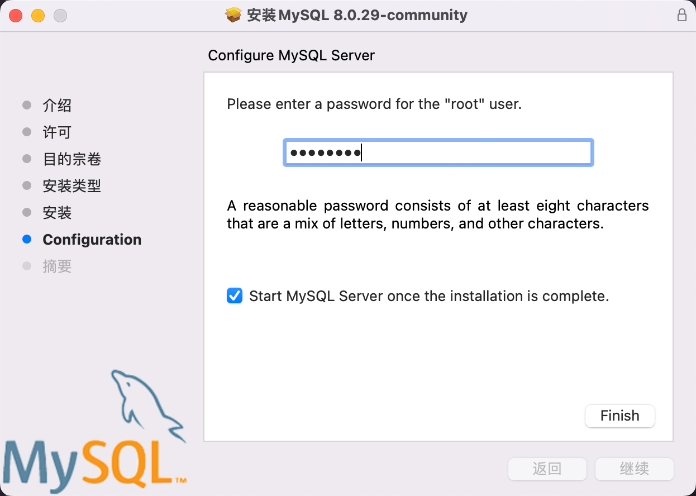
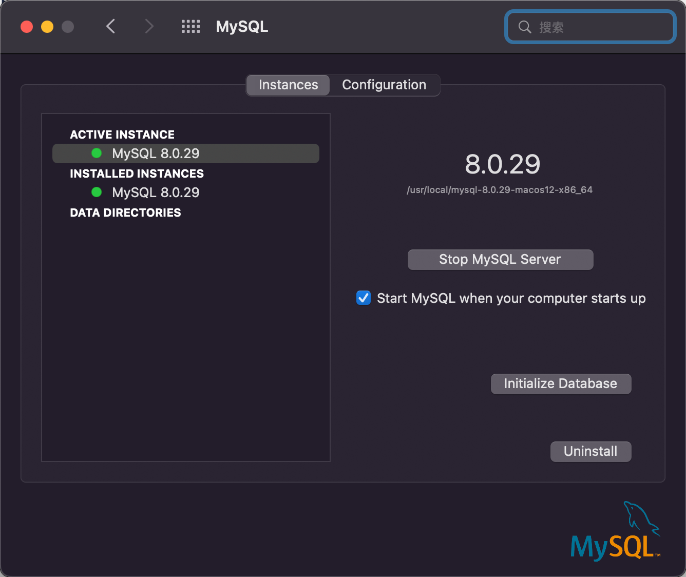
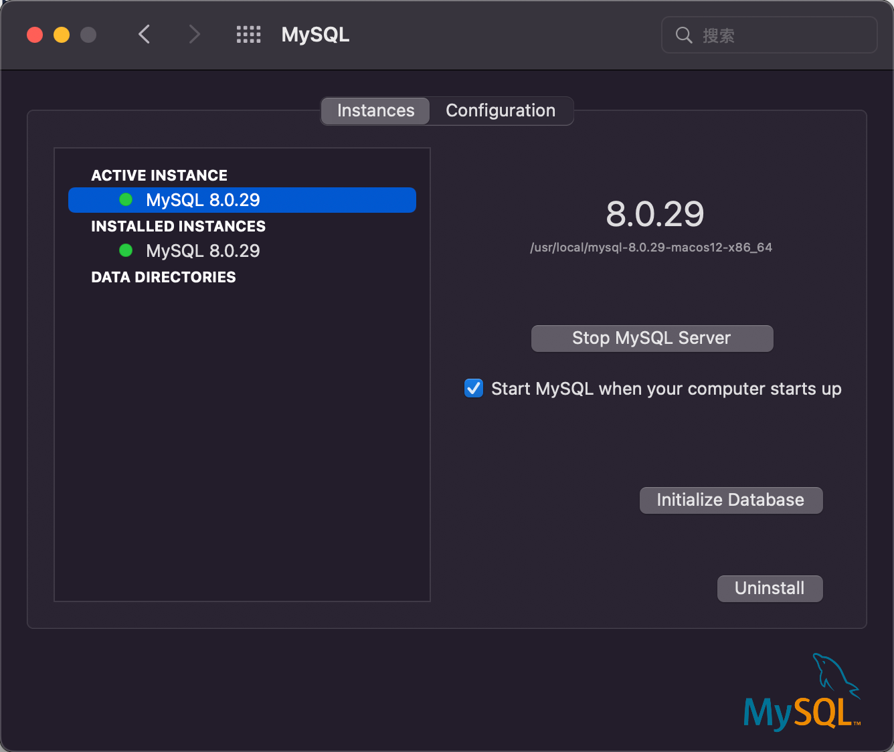
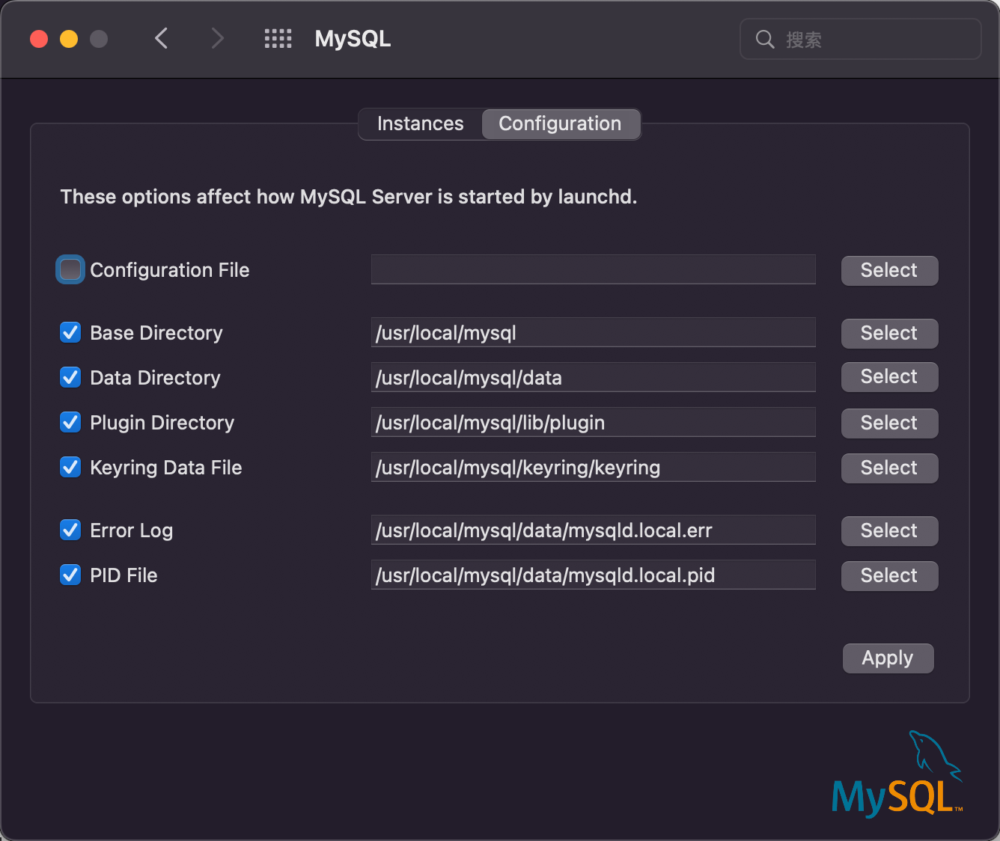

## 概述


文章转自：http://blog.csdn.net/RunIntoLove/article/details/51422787

最近需要在电脑上自己搭一个数据库，由于在大学期间使用的是MySQL，也算是对它情有独钟吧，这次在Mac上依旧就使用MySQL吧，在这里记录一下安装以及配置的过程（注：博文中使用的OS X版本为:10.11.4) 

### 下载Mysql

一般情况，首先想到的必然会是官方网站，这里给出下载地址:MySQL Server官网下载
https://dev.mysql.com/downloads/file/?id=476233
https://dev.mysql.com/downloads/file/?id=495298

最新的版本是8.0.20：https://cdn.mysql.com//Downloads/MySQL-8.0/mysql-8.0.20-macos10.15-x86_64.dmg

最新的版本是8.0.20：https://dev.mysql.com/get/Downloads/MySQL-8.0/mysql-8.0.29-macos12-x86_64.dmg


安装步骤很简单，一路Next 到最后配置的时候，只有这个地方需要注意，这个地方需要输入密码。主要是密码必须是一个8位的密码。

好了，支持MySql安装成功。


## MacOS版本的安装：


从上图可以看出它已经识别出来电脑的系统的型号，但是为了拓展一下，还是给出一个查看Mac OS X系统是32位还是64位的简单方法 
在终端使用命令行uname -a 
查看打印结果:
X86_64表示系统为64位
i686表示系统为32位
下面是楼主电脑的打印结果，结果来看楼主的系统是64位的:

```
arwin RITLMacBook-Pro.local 15.4.0 
Darwin Kernel Version 15.4.0: Fri Feb 26 22:08:05 PST 2016;
root:xnu-3248.40.184~3/RELEASE_X86_64 x86_64
```

更多查看OS X系统位数的方法请查看博文如何查看mac系统是32位还是64位的操作系统 
https://blog.csdn.net/duxinfeng2010/article/details/8629435

我选择的是最后一个dmg格式的安装包，点击download，会出现让我们注册登陆的界面，点击最下面的No thanks,just take me to downloads!直接进行下载即可: 


```
017-10-31T06:16:55.556145Z 1 [Note] A temporary password is generated for root@localhost: O+hMujru+5jh
If you lose this password, please consult the section How to Reset the Root Password in the MySQL reference manual.
```
打开下载的安装包，点击最后一个文件进行安装，一路Next完成:


安装完毕之后会弹出一个会话框，这里需要注意下，它会告诉我们root用户的初始密码，别忽略了…


安装完毕，打开偏好设置，查看一下是否已经安装好MySQL，楼主的MySQL看来是安装成功了，哦也

	


### 启动MySQL
通过点击偏好设置里的MySQL负责启动或者停止MySQL


当然也可以直接双击(双指点击都懂得)进行快速进入




### 启动MySQL服务

打开终端，输入

```
cd ~
touch .bash_profile
open -e .bash_profile
```
在打开的文件中输入：

```shell
# >>> Tomcat Home  >>>
export PATH=$PATH:/Users/frewen/Library/AFrewenLib/apache-tomcat-10.0.20/bin
# <<< Tomcat Home  <<<

# >>> Mysql Home  >>>
export PATH=${PATH}:/usr/local/mysql/bin
# >>> Mysql Home  >>>
```
然后保存，退出文件，关闭终端并退出。

现在你就可以通过 mysql -u root -p 登录 mysql 了，会让你输入密码，就是通知中心上的。

```
 mysql -u root -p
```

登录成功后，你可以通过下面的命令修改密码

```
SET PASSWORD FOR 'root'@'localhost' = PASSWORD('新密码');
```


## Windows版本安装


WIndows版本的解压缩版的下载安装步骤：https://jingyan.baidu.com/article/f3ad7d0ffc061a09c3345bf0.html