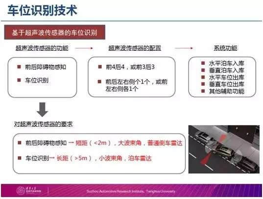
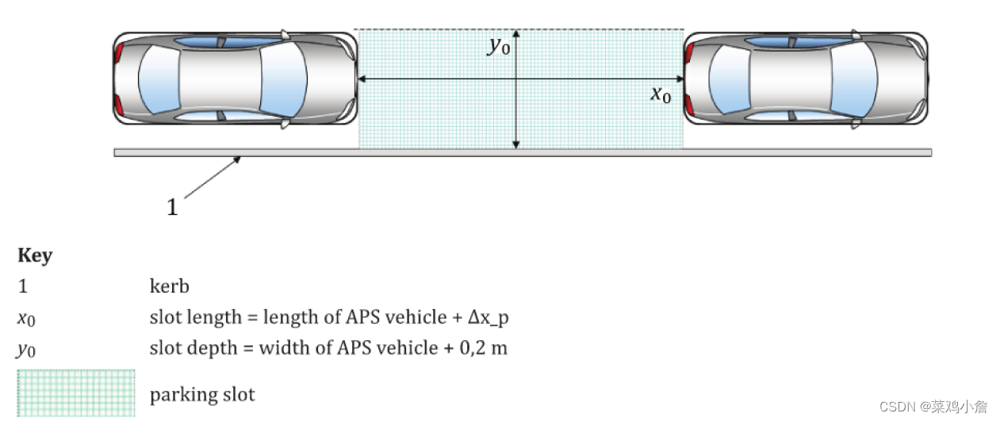
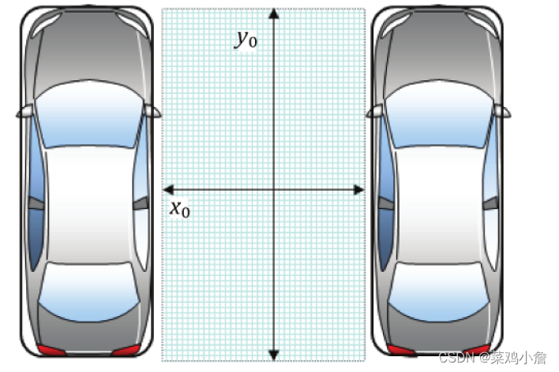
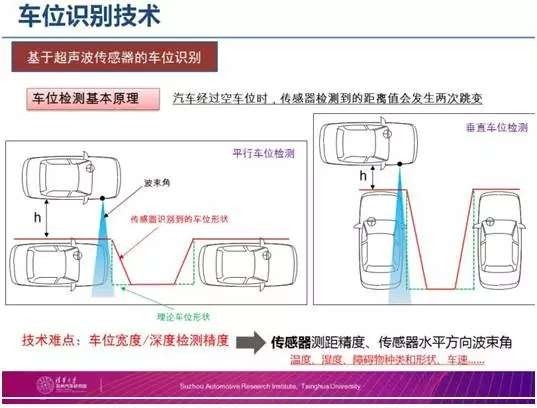

[TOC]

# 概述

文章参考：https://www.rstk.cn/news/18889.html?action=onClick

文章参考：https://bbs.xiaopeng.com/article/212951

文章参考：https://www.leiphone.com/category/transportation/SaiLjC9OApbcIx7Z.html

文章参考：https://www.rstk.cn/news/18889.html?action=onClick

关于车位识别技术，包括两种：一种是空间车位，利用超声波检测；另一种是线车位，通过摄像头检测。

一般由泊车域控制器+12超声波传感器+4个鱼眼相机+EPS(转向执行器）+ESP（制动执行器）+HU(中控显示）等组成

# 空间车位

## 水平空间车位

水平空间车位如下图所示。车位长x0为车长+Δx_p，车位宽度为y0为车宽+0.2m。在该场景下，APS系统需要考虑有无侧方参照物。如果存在侧方参照物，那么泊车姿态需要参考侧方参照物。如果不存在，则需要参考两侧的参考车进行泊车姿态的描画。该标准中只定义了最基本的场景，具体的用户场景可以根据此基本场景进行一定的延申，以OEM定义为主。

## 垂直空间车位

垂直空间车位如下图所示。车位宽x0为车宽+Δx_l，车位深度为y0为车长。该标准中只定义了最基本的场景，具体的用户场景可以根据此基本场景进行一定的延申，以OEM定义为主。

关于Δx_l的值，该标准定义里面推荐范围为1.2m

# 车位搜索

车位搜索：一般依靠视觉搜索划线车位，四路鱼眼图像进行畸变校正，动态拼接成为俯视BEV图，在此BEV图上进行车位搜索，输出车位及其类型（水平/垂直/斜列），在车位搜索过程中，通过视觉算法进行障碍物识别，语义分割出路延，freespace等的轮廓。对于空间车位的探扫，一般用超声波传感器（侧面的APA），超声波通过多个探头回波产生特征点，进行聚类形成空间车位轮廓并释放，并输出超声探测到的障碍物，最后视觉和超声进行融合。另外，泊入的过程需要足够的路径规划的空间，所以，通道宽度过窄的情况下一般车位也不会被释放。

# **超声波传感器车位识别**

超声波传感器的功能需求，主要用于前后障碍物的感知和车位识别。这里我们讲的是车位识别，对于车位识别传感器的要求，一个远距离的（5米）。

现在博世、法雷奥的传感器是4.5米，他们要求要有一个小的波束角。前后障碍物感知用的传感器，普通倒车雷达就能满足，它的探测距离是2米，这就要求它有一个大的波束角。

在传感器配置方面，现在关于前后倒车雷达检测，一般是“前4后4”的配置，或者是降成本方案“前3后3”的配置。另外，在垂直泊车的时候，需要用到后两个测向的传感器。

# AVP泊车局限

因硬件局限性，特殊场景的车位识别会有障碍： （1）摄像头在车位框清晰时识别是相当精准的，但受光线和其他线段干扰较大，像昏暗的停车场，地面的胎痕等； （2）超声波雷达传感器通过检测周围物体距离，实时进行空间位置判断，但会因探测距离和角度影响探测精度，建议大家找车位时，可以靠近车位的一边慢开。

体验的时候也发现，在进行车位搜索的时候，最好靠近车位一侧进行慢行。